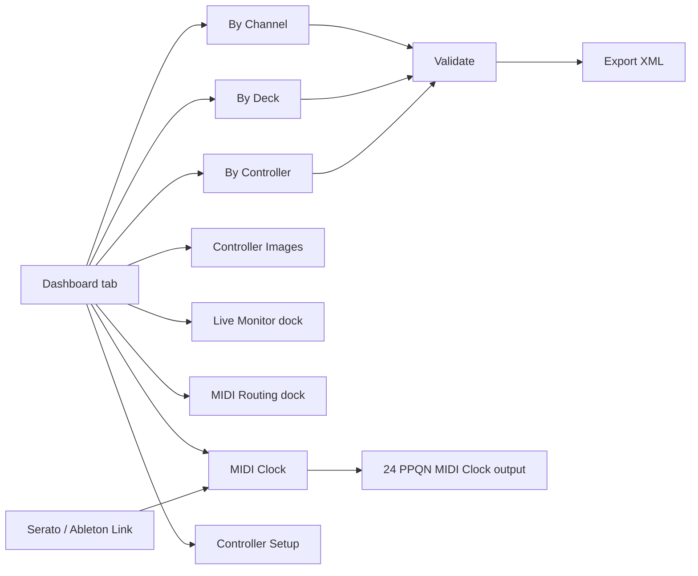

# DJ MIDI Studio 🎛️

Edit DJ software MIDI mappings with a visual workflow instead of hand-editing thousands of XML lines.

  <strong>See the mapping. Hear the change. Keep control. 🎚️</strong> 
  A visual MIDI workbench for DJ controllers, Serato, Traktor, and hardware-friendly workflows.

  
  
  

  

## Table of Contents

- [Why This Project](#why-this-project)
- [Key Features](#key-features)
- [Install](#install)
- [Screens and Layouts](#screens-and-layouts)
- [Screens and Workflow](#screens-and-workflow)
- [Release Process](#release-process)
- [End-to-End Examples](#end-to-end-examples)
- [Documentation Index](#documentation-index)
- [Developer and AI-Assisted Development](#developer-and-ai-assisted-development)
- [Technical References](#technical-references)

## Why This Project

DJ MIDI mapping files can become very large and hard to maintain. DJ MIDI Studio provides:

- 🧩 structured parsing into a typed model,
- 🗺️ GUI views for channel/deck/controller perspectives,
- ✏️ safe grouped edits for duplicated trigger patterns,
- ✅ validation and XML export back to Serato-compatible or Traktor NML format.

## Key Features

| | What you get |
|---|---|
| 🎨 | Visual mapping workflow with Dashboard, controller layouts, and synchronized tree views |
| 🎛️ | Catalogs for DDJ-XP2, XDJ-XZ, DDJ-1000, DDJ-FLX4, DDJ-FLX10, DDJ-REV1, Mixtrack Pro FX, and Inpulse 500 |
| 🎧 | Serato DJ and Native Instruments Traktor integrations |
| 🔎 | MIDI learning, Live Monitor, source-device tracking, and controller lookup |
| 🔀 | Safe one-way MIDI routing with cycle prevention and error diagnostics |
| 🕒 | MIDI Clock mirroring plus read-only Ableton Link → 24 PPQN output |
| 💾 | Validation, safe updates, backups, previews, rollback, and XML round-tripping |

## Install

📦 **Use a release build.** Download the archive for your operating system from
the [latest release](https://github.com/guillain/DJ-MIDI-Studio/releases/latest),
unpack it, and run the bundled `djmidi` executable — no Python or `uv`
required. The user guide, controller references, and PDFs ship inside the
bundle, so everything works offline.

- Verify the download against the published `SHA-256` checksums.
- macOS: the app is unsigned; on first launch use right-click → **Open** (or
  clear the quarantine flag) to get past Gatekeeper.
- Logs go to the platform user log directory; pass `--log-level DEBUG
  --log-file <path>` when reporting an issue.

Running from source is for contributors — see
[Developer Setup](docs/development/setup.md).

## Screens and Layouts

Here is the short visual tour. The complete annotated guide is available in
[Screens and Layouts](docs/screens-and-layouts.md).

| Dashboard | By Controller |
|---|---|
|  |  |

| By Deck | Controller Images |
|---|---|
|  |  |

| Live Monitor | MIDI Routing |
|---|---|
|  |  |

| MIDI Clock | Metronome |
|---|---|
|  |  |

💡 The MIDI tools can stay docked, float independently, or be restored to the
previous user arrangement.

## Screens and Workflow

## Release Process

📦 Releases are built by GitHub Actions and published from annotated tags.

- Every push and Pull Request runs the multi-platform CI build after the quality gate.
- Tag format: `v*` (example: `v0.44.0`).
- Workflow `.github/workflows/draft-release.yml` builds package + executables and publishes a **GitHub release** with attached artifacts.
- Final checklist: see `docs/release-checklist.md`.

## End-to-End Examples

🧭 Follow the examples for a complete workflow from port detection to routing.

See the [end-to-end examples](docs/examples.md) for controller detection,
mapping parsing, Live Monitor, MIDI routing, and unknown-device workflows.

## Documentation Index

📚 The documentation is intentionally local and bundled with the application:

- [Documentation Home](docs/README.md)
- [Controller documentation and official PDF sources](docs/controllers/README.md)
- [User Guide](docs/user-guide.md) — everyday workflow, including sending MIDI commands from the CLI
- [Screens and Layouts](docs/screens-and-layouts.md)
- [Architecture](docs/architecture.md)
- [End-to-End Examples](docs/examples.md)
- [Testing and Quality](docs/testing-and-quality.md)
- [Quality Gates](docs/quality-gates.md)
- [Build and Release](docs/build-and-release.md)
- [Release Checklist](docs/release-checklist.md)

For running from source, the quickstart and the local test/build scripts, see
the developer docs below.

## Developer and AI-Assisted Development

🛠️ Contributors can start with [Developer Setup](docs/development/setup.md)
(prerequisites, `uv sync`, running from source, and the local `scripts/`
lint/test/build/screenshot commands), the [Quickstart](docs/quickstart.md),
[Development Workflow](docs/development/workflow.md), and
[Contributing](docs/development/contributing.md). This project also documents
its vibe-coding workflow and reusable agent assets:
[AI-Assisted Development](docs/agents/ai-assisted-development.md) and the
[Agent Assets Index](docs/agents/assets/README.md).

The implementation timeline is captured in the [Recent Evolution Chapters](docs/development/evolution.md),
including architecture diagrams, validation boundaries, and screenshot references.

## Technical References

🔗 Official software and controller references:

- [Serato MIDI Mapping Guide](https://support.serato.com/hc/en-us/articles/209377487-MIDI-mapping-with-Serato-DJ-Pro)
- [Traktor integration guide](docs/traktor.md)
- [Controller documentation index and bundled PDFs](docs/controllers/README.md)
- [Pioneer DJ XDJ-XZ MIDI Message List](docs/controllers/xdj-xz-midi-message-list-e3.pdf)
- [Pioneer DJ DDJ-XP2 MIDI Message List](docs/controllers/ddj-xp2-midi-message-list-e1.pdf)
- [Pioneer DJ DDJ-FLX10 MIDI Message List](docs/controllers/ddj-flx10-midi-message-list-e1.pdf)
- [Pioneer DJ DDJ-FLX4 product page](https://www.pioneerdj.com/en/product/dj-controllers/ddj-flx4/)
- [Pioneer DJ DDJ-REV1 MIDI Message List](docs/controllers/ddj-rev1-midi-message-list-e1.pdf)
- [Numark Mixtrack Pro FX User Guide](docs/controllers/numark-mixtrack-pro-fx-user-guide-v1.2.pdf)
- [Hercules DJControl Inpulse 500 Product Sheet](docs/controllers/hercules-djcontrol-inpulse-500-product-sheet-fr.pdf)
