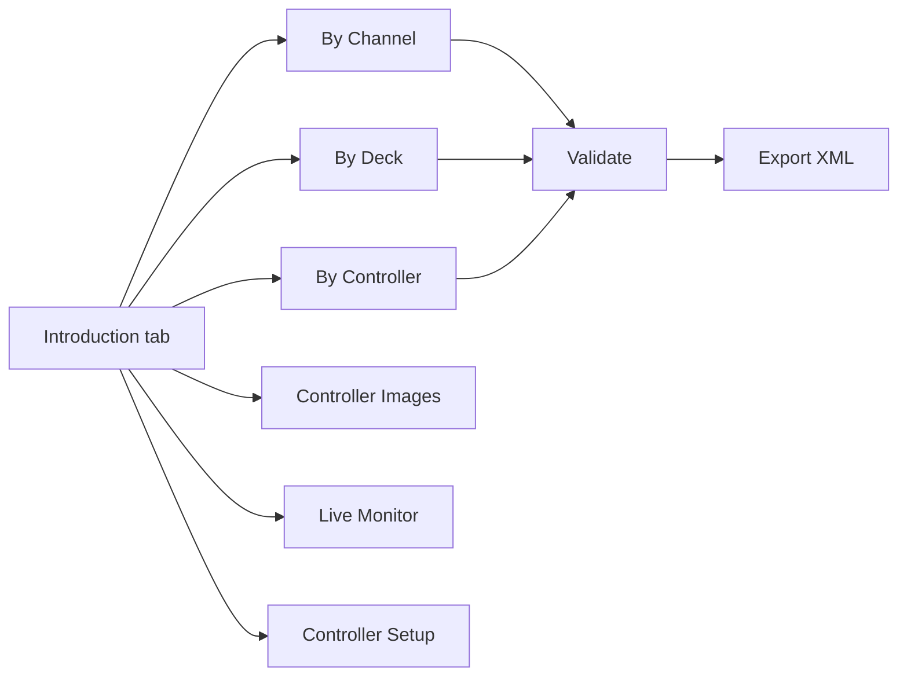

# Serato MIDI Config Visualizer & Editor

Edit large Serato DJ Pro MIDI XML mappings with a visual workflow instead of hand-editing thousands of XML lines.

## Table of Contents

- [Why This Project](#why-this-project)
- [Key Features](#key-features)
- [Screens and Workflow](#screens-and-workflow)
- [Quickstart](#quickstart)
- [Build and Test Scripts](#build-and-test-scripts)
- [Release Process](#release-process)
- [Documentation Index](#documentation-index)
- [Technical References](#technical-references)

## Why This Project

Serato MIDI mapping files can become very large and hard to maintain. This project provides:

- structured parsing into a typed model,
- GUI views for channel/deck/controller perspectives,
- safe grouped edits for duplicated trigger patterns,
- validation and XML export back to Serato-compatible format.

## Key Features

- XML parse/export round-trip tooling for Serato MIDI config files.
- Multi-view GUI: `By Channel`, `By Deck`, `By Controller`, `Controller Images`, `Live Monitor`, `Controller Setup`.
- New `Introduction` dashboard with known-controller cards and drill-down navigation.
- Dynamic plugin-style controller catalog registry.
- Validation for structure and mapping conflicts.

## Screens and Workflow



## Quickstart

Install dependencies:

```bash
bash scripts/bootstrap.sh
```

or manually:

```bash
uv sync --group dev
```

Run the app:

```bash
uv run seratomidiconf
```

Run tests:

```bash
uv run pytest
```

## Build and Test Scripts

- `scripts/test.sh`: lint/test entrypoint (`all`, `quick`, `lint`, `test`, `path`).
- `scripts/bootstrap.sh`: one-command local setup and pre-commit quick check hook.
- `scripts/build.sh`: build wheel/sdist and native executable bundle for current OS.
- `scripts/release_artifacts.sh`: archive OS-specific executable artifacts.
- `.github/workflows/build-executables.yml`: CI matrix build for macOS/Linux/Windows executables.

Examples:

```bash
bash scripts/test.sh quick
bash scripts/build.sh
bash scripts/release_artifacts.sh
```

## Release Process

- Tag format: `v*` (example: `v0.1.0`).
- Workflow `.github/workflows/draft-release.yml` builds package + executables and creates a **draft GitHub release** with attached artifacts.
- Final checklist: see `docs/release-checklist.md`.

## Documentation Index

- [Documentation Home](docs/README.md)
- [Quickstart](docs/quickstart.md)
- [User Guide](docs/user-guide.md)
- [Architecture](docs/architecture.md)
- [Testing and Quality](docs/testing-and-quality.md)
- [Build and Release](docs/build-and-release.md)
- [Release Checklist](docs/release-checklist.md)

## Technical References

- [Serato MIDI Mapping Guide](https://support.serato.com/hc/en-us/articles/209377487-MIDI-mapping-with-Serato-DJ-Pro)
- [Pioneer DJ XDJ-XZ MIDI Message List](https://downloads.support.alphatheta.com/software_info/all-in-one-dj-systems/XDJ-XZ/XDJ-XZ_MIDI_Message_List_E3.pdf)
- [Pioneer DJ DDJ-XP2 MIDI Message List](https://downloads.support.alphatheta.com/software_info/dj-controllers/DDJ-XP2/DDJ-XP2_MIDI_Message_List_E1.pdf)
