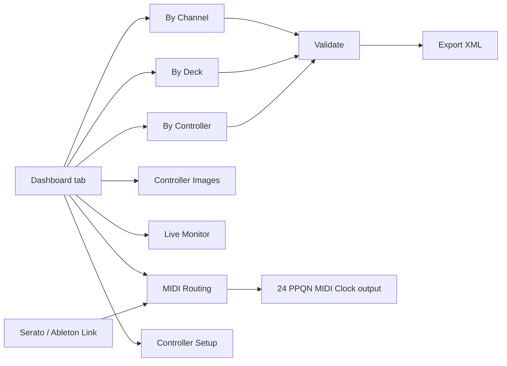

# DJ MIDI Studio

Edit DJ software MIDI mappings with a visual workflow instead of hand-editing thousands of XML lines.

## Table of Contents

- [Why This Project](#why-this-project)
- [Key Features](#key-features)
- [Screens and Workflow](#screens-and-workflow)
- [Screens and Layouts](#screens-and-layouts)
- [Quickstart](#quickstart)
- [Build and Test Scripts](#build-and-test-scripts)
- [Send MIDI Commands](#send-midi-commands)
- [Release Process](#release-process)
- [Documentation Index](#documentation-index)
- [End-to-End Examples](#end-to-end-examples)
- [Technical References](#technical-references)

## Why This Project

DJ MIDI mapping files can become very large and hard to maintain. DJ MIDI Studio provides:

- structured parsing into a typed model,
- GUI views for channel/deck/controller perspectives,
- safe grouped edits for duplicated trigger patterns,
- validation and XML export back to Serato-compatible or Traktor NML format.

## Key Features

- XML parse/export round-trip tooling for Serato MIDI config files.
- Multi-view GUI: `By Channel`, `By Deck`, `By Controller`, `Controller Images`, `Live Monitor`, `MIDI Routing`, `Controller Setup`.
- New `Dashboard` with known-controller cards, MIDI availability indicators, and drill-down navigation.
- Dynamic plugin-style controller catalog registry.
- Plugin-discovered MIDI catalogs for DDJ-XP2, XDJ-XZ, DDJ-1000, DDJ-FLX4, DDJ-FLX10, DDJ-REV1, Numark Mixtrack Pro FX, and Hercules DJControl Inpulse 500.
- Plugin-discovered DJ software integrations for Serato DJ and Native Instruments Traktor.
- Validation for structure and mapping conflicts.
- Send saved Controller Setup session commands directly to a selected MIDI output, with looping/repeat playback integrated into `MIDI Routing`.
- Follow Ableton Link as a read-only tempo/phase source and generate standard 24 PPQN MIDI Clock without requiring Ableton Live.

## Screens and Workflow



### Screens and Layouts

For annotated screenshots of the main tabs, see [Screens and Layouts](docs/screens-and-layouts.md).

## Quickstart

Install dependencies:

```bash
bash scripts/bootstrap.sh
```

or manually:

```bash
uv sync --group dev
```

Direct Ableton Link following is optional. Install its native binding when
using `Ableton Link (DJ MIDI Studio)` as a Clock source:

```bash
uv add aalink
```

Run the app:

```bash
uv run djmidi
uv run djmidi --log-level DEBUG --log-file /tmp/djmidi.log
```

The application writes a rotating execution log by default to the platform's
user log directory. Use `--log-level` (`DEBUG`, `INFO`, `WARNING`, `ERROR`, or
`CRITICAL`) and `--log-file` to control verbosity and destination.

Run tests:

```bash
uv run pytest
```

## Build and Test Scripts

- `scripts/test.sh`: lint/test entrypoint (`all`, `quick`, `lint`, `test`, `path`).
- `scripts/quality_gate.sh`: enforces quality/security targets (coverage, smell, duplication, vulnerabilities).
- `scripts/bootstrap.sh`: one-command local setup and pre-commit quick check hook.
- `scripts/build.sh`: build wheel/sdist and native executable bundle for current OS.
- `scripts/release_artifacts.sh`: archive OS-specific executable artifacts.
- `.github/workflows/build-executables.yml`: CI matrix build for macOS/Linux/Windows executables.

## Send MIDI Commands

You can send one-shot NOTE/CC commands directly to a controller output port:

```bash
uv run djmidi-send-midi --list-ports
uv run djmidi-send-midi --port "Your Port Name" --type note_on --channel 1 --data1 27 --data2 127
uv run djmidi-send-midi --port "Your Port Name" --type note_off --channel 1 --data1 27 --data2 0
```

DDJ-XP2 known `PAD MODE` button notes (deck channels `1..4`):

- `PAD MODE 1` -> `data1=27`
- `PAD MODE 2` -> `data1=30`
- `PAD MODE 3` -> `data1=32`
- `PAD MODE 4` -> `data1=34`

The second physical click is a different NOTE, which is what the Live Monitor
will display:

- `PAD MODE 5` -> `data1=28`
- `PAD MODE 6` -> `data1=31`
- `PAD MODE 7` -> `data1=33`
- `PAD MODE 8` -> `data1=35`

On the DDJ-XP2, `PAD MODE 5..8` are reached by double-clicking `PAD MODE 1..4`:

- double-click `PAD MODE 1` -> `PAD MODE 5`
- double-click `PAD MODE 2` -> `PAD MODE 6`
- double-click `PAD MODE 3` -> `PAD MODE 7`
- double-click `PAD MODE 4` -> `PAD MODE 8`

CLI example to emulate a double-click on `PAD MODE 1` (Deck channel `1`):

```bash
uv run djmidi-send-midi --port "Your Port Name" --type note_on --channel 1 --data1 27 --data2 127
uv run djmidi-send-midi --port "Your Port Name" --type note_off --channel 1 --data1 27 --data2 0
uv run djmidi-send-midi --port "Your Port Name" --type note_on --channel 1 --data1 27 --data2 127
uv run djmidi-send-midi --port "Your Port Name" --type note_off --channel 1 --data1 27 --data2 0
```

Equivalent one-liner using the built-in helper:

```bash
uv run djmidi-send-midi --port "Your Port Name" --type note_on --channel 1 --data1 27 --data2 127 --double-click
```

Examples:

```bash
bash scripts/test.sh quick
bash scripts/test.sh quality
bash scripts/build.sh
bash scripts/release_artifacts.sh
```

## Release Process

- Tag format: `v*` (example: `v0.1.0`).
- Workflow `.github/workflows/draft-release.yml` builds package + executables and creates a **draft GitHub release** with attached artifacts.
- Final checklist: see `docs/release-checklist.md`.

## End-to-End Examples

See the [end-to-end examples](docs/examples.md) for controller detection,
mapping parsing, Live Monitor, MIDI routing, and unknown-device workflows.

## Documentation Index

- [Documentation Home](docs/README.md)
- [Controller documentation and official PDF sources](docs/controllers/README.md)
- [Quickstart](docs/quickstart.md)
- [User Guide](docs/user-guide.md)
- [Screens and Layouts](docs/screens-and-layouts.md)
- [Architecture](docs/architecture.md)
- [End-to-End Examples](docs/examples.md)
- [Testing and Quality](docs/testing-and-quality.md)
- [Quality Gates](docs/quality-gates.md)
- [Build and Release](docs/build-and-release.md)
- [Release Checklist](docs/release-checklist.md)

## Technical References

- [Serato MIDI Mapping Guide](https://support.serato.com/hc/en-us/articles/209377487-MIDI-mapping-with-Serato-DJ-Pro)
- [Traktor integration guide](docs/traktor.md)
- [Controller documentation index and bundled PDFs](docs/controllers/README.md)
- [Pioneer DJ XDJ-XZ MIDI Message List](docs/controllers/xdj-xz-midi-message-list-e3.pdf)
- [Pioneer DJ DDJ-XP2 MIDI Message List](docs/controllers/ddj-xp2-midi-message-list-e1.pdf)
- [Pioneer DJ DDJ-FLX10 MIDI Message List](docs/controllers/ddj-flx10-midi-message-list-e1.pdf)
- [Pioneer DJ DDJ-FLX4 product page](https://www.pioneerdj.com/en/product/dj-controllers/ddj-flx4/)
- [Pioneer DJ DDJ-REV1 MIDI Message List](docs/controllers/ddj-rev1-midi-message-list-e1.pdf)
- [Numark Mixtrack Pro FX User Guide](docs/controllers/numark-mixtrack-pro-fx-user-guide-v1.2.pdf)
- [Hercules DJControl Inpulse 500 Product Sheet](docs/controllers/hercules-djcontrol-inpulse-500-product-sheet-fr.pdf)
