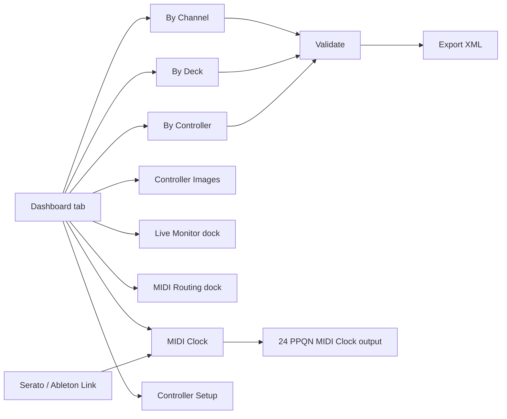

# DJ MIDI Studio 🎛️

Edit DJ software MIDI mappings with a visual workflow instead of hand-editing thousands of XML lines.

<p align="center">
  <strong>See the mapping. Hear the change. Keep control. 🎚️</strong><br>
  A visual MIDI workbench for DJ controllers, Serato, Traktor, and hardware-friendly workflows.
</p>

<p align="center">
  <a href="https://github.com/guillain/DJ-MIDI-Studio/actions/workflows/build-executables.yml"></a>
  <a href="https://github.com/guillain/DJ-MIDI-Studio/releases"></a>
  <a href="docs/README.md"></a>
</p>

<p align="center">
  
</p>

## Table of Contents

- [Why This Project](#why-this-project)
- [Key Features](#key-features)
- [Screens and Workflow](#screens-and-workflow)
- [Screens and Layouts](#screens-and-layouts)
- [Quickstart](#quickstart)
- [Build and Test Scripts](#build-and-test-scripts)
- [Send MIDI Commands](#send-midi-commands)
- [Release Process](#release-process)
- [Documentation Index](#documentation-index)
- [Developer and AI-Assisted Development](#developer-and-ai-assisted-development)
- [End-to-End Examples](#end-to-end-examples)
- [Technical References](#technical-references)

## Why This Project

DJ MIDI mapping files can become very large and hard to maintain. DJ MIDI Studio provides:

- 🧩 structured parsing into a typed model,
- 🗺️ GUI views for channel/deck/controller perspectives,
- ✏️ safe grouped edits for duplicated trigger patterns,
- ✅ validation and XML export back to Serato-compatible or Traktor NML format.

## Key Features

| | What you get |
|---|---|
| 🎨 | Visual mapping workflow with Dashboard, controller layouts, and synchronized tree views |
| 🎛️ | Catalogs for DDJ-XP2, XDJ-XZ, DDJ-1000, DDJ-FLX4, DDJ-FLX10, DDJ-REV1, Mixtrack Pro FX, and Inpulse 500 |
| 🎧 | Serato DJ and Native Instruments Traktor integrations |
| 🔎 | MIDI learning, Live Monitor, source-device tracking, and controller lookup |
| 🔀 | Safe one-way MIDI routing with cycle prevention and error diagnostics |
| 🕒 | MIDI Clock mirroring plus read-only Ableton Link → 24 PPQN output |
| 💾 | Validation, safe updates, backups, previews, rollback, and XML round-tripping |

## Screens and Layouts

Here is the short visual tour. The complete annotated guide is available in
[Screens and Layouts](docs/screens-and-layouts.md).

| Dashboard | By Controller |
|---|---|
|  |  |

| By Deck | Controller Images |
|---|---|
|  |  |

| Live Monitor | MIDI Routing |
|---|---|
|  |  |

| MIDI Clock | Metronome |
|---|---|
|  |  |

💡 The MIDI tools can stay docked, float independently, or be restored to the
previous user arrangement.

## Screens and Workflow



## Quickstart

🚀 **Ready to explore?** The local documentation is bundled with the app, so
the mapping references remain available when working offline.

Install dependencies:

```bash
bash scripts/bootstrap.sh
```

or manually:

```bash
uv sync --group dev
```

Ableton Link support is included by default with its native binding:

```bash
uv sync --group dev
```

Run the app:

```bash
uv run djmidi
uv run djmidi --log-level DEBUG --log-file /tmp/djmidi.log
```

The application writes a rotating execution log by default to the platform's
user log directory. Use `--log-level` (`DEBUG`, `INFO`, `WARNING`, `ERROR`, or
`CRITICAL`) and `--log-file` to control verbosity and destination.

Run tests:

```bash
uv run pytest
```

## Build and Test Scripts

🧪 The same quality gate used by CI can be run locally before opening a PR:

- `scripts/test.sh`: lint/test entrypoint (`all`, `quick`, `lint`, `test`, `path`).
- `scripts/quality_gate.py` / `scripts/quality_gate.sh`: coverage, maintainability, duplication, and security gate.
- `scripts/capture_docs_screenshots.py`: regenerates UI screenshots from the reference XML without MIDI hardware.
- `scripts/bootstrap.sh`: one-command local setup and pre-commit quick check hook.
- `scripts/build.sh`: build wheel/sdist and native executable bundle for current OS.
- `scripts/release_artifacts.sh`: archive OS-specific executable artifacts.
- `.github/workflows/build-executables.yml`: CI matrix build for macOS/Linux/Windows executables.

## Send MIDI Commands

⚡ Useful for testing a mapping without touching the GUI. Always select the
correct MIDI output port before sending commands to hardware.

You can send one-shot NOTE/CC commands directly to a controller output port:

```bash
uv run djmidi-send-midi --list-ports
uv run djmidi-send-midi --port "Your Port Name" --type note_on --channel 1 --data1 27 --data2 127
uv run djmidi-send-midi --port "Your Port Name" --type note_off --channel 1 --data1 27 --data2 0
```

DDJ-XP2 known `PAD MODE` button notes (deck channels `1..4`):

- `PAD MODE 1` -> `data1=27`
- `PAD MODE 2` -> `data1=30`
- `PAD MODE 3` -> `data1=32`
- `PAD MODE 4` -> `data1=34`

The second physical click is a different NOTE, which is what the Live Monitor
will display:

- `PAD MODE 5` -> `data1=28`
- `PAD MODE 6` -> `data1=31`
- `PAD MODE 7` -> `data1=33`
- `PAD MODE 8` -> `data1=35`

On the DDJ-XP2, `PAD MODE 5..8` are reached by double-clicking `PAD MODE 1..4`:

- double-click `PAD MODE 1` -> `PAD MODE 5`
- double-click `PAD MODE 2` -> `PAD MODE 6`
- double-click `PAD MODE 3` -> `PAD MODE 7`
- double-click `PAD MODE 4` -> `PAD MODE 8`

CLI example to emulate a double-click on `PAD MODE 1` (Deck channel `1`):

```bash
uv run djmidi-send-midi --port "Your Port Name" --type note_on --channel 1 --data1 27 --data2 127
uv run djmidi-send-midi --port "Your Port Name" --type note_off --channel 1 --data1 27 --data2 0
uv run djmidi-send-midi --port "Your Port Name" --type note_on --channel 1 --data1 27 --data2 127
uv run djmidi-send-midi --port "Your Port Name" --type note_off --channel 1 --data1 27 --data2 0
```

Equivalent one-liner using the built-in helper:

```bash
uv run djmidi-send-midi --port "Your Port Name" --type note_on --channel 1 --data1 27 --data2 127 --double-click
```

Examples:

```bash
bash scripts/test.sh quick
bash scripts/test.sh quality
bash scripts/build.sh
bash scripts/release_artifacts.sh
```

## Release Process

📦 Releases are built by GitHub Actions and published from annotated tags.

- Every push and Pull Request runs the multi-platform CI build after the quality gate.
- Tag format: `v*` (example: `v0.44.0`).
- Workflow `.github/workflows/draft-release.yml` builds package + executables and publishes a **GitHub release** with attached artifacts.
- Final checklist: see `docs/release-checklist.md`.

## End-to-End Examples

🧭 Follow the examples for a complete workflow from port detection to routing.

See the [end-to-end examples](docs/examples.md) for controller detection,
mapping parsing, Live Monitor, MIDI routing, and unknown-device workflows.

## Documentation Index

📚 The documentation is intentionally local and bundled with the application:

- [Documentation Home](docs/README.md)
- [Controller documentation and official PDF sources](docs/controllers/README.md)
- [Quickstart](docs/quickstart.md)
- [User Guide](docs/user-guide.md)
- [Screens and Layouts](docs/screens-and-layouts.md)
- [Architecture](docs/architecture.md)
- [End-to-End Examples](docs/examples.md)
- [Testing and Quality](docs/testing-and-quality.md)
- [Quality Gates](docs/quality-gates.md)
- [Build and Release](docs/build-and-release.md)
- [Release Checklist](docs/release-checklist.md)

## Developer and AI-Assisted Development

🛠️ Contributors can start with [Developer Setup](docs/development/setup.md),
[Development Workflow](docs/development/workflow.md), and
[Contributing](docs/development/contributing.md). This project also documents
its vibe-coding workflow and reusable agent assets:
[AI-Assisted Development](docs/agents/ai-assisted-development.md) and the
[Agent Assets Index](docs/agents/assets/README.md).

The implementation timeline is captured in the [Recent Evolution Chapters](docs/development/evolution.md),
including architecture diagrams, validation boundaries, and screenshot references.

## Technical References

🔗 Official software and controller references:

- [Serato MIDI Mapping Guide](https://support.serato.com/hc/en-us/articles/209377487-MIDI-mapping-with-Serato-DJ-Pro)
- [Traktor integration guide](docs/traktor.md)
- [Controller documentation index and bundled PDFs](docs/controllers/README.md)
- [Pioneer DJ XDJ-XZ MIDI Message List](docs/controllers/xdj-xz-midi-message-list-e3.pdf)
- [Pioneer DJ DDJ-XP2 MIDI Message List](docs/controllers/ddj-xp2-midi-message-list-e1.pdf)
- [Pioneer DJ DDJ-FLX10 MIDI Message List](docs/controllers/ddj-flx10-midi-message-list-e1.pdf)
- [Pioneer DJ DDJ-FLX4 product page](https://www.pioneerdj.com/en/product/dj-controllers/ddj-flx4/)
- [Pioneer DJ DDJ-REV1 MIDI Message List](docs/controllers/ddj-rev1-midi-message-list-e1.pdf)
- [Numark Mixtrack Pro FX User Guide](docs/controllers/numark-mixtrack-pro-fx-user-guide-v1.2.pdf)
- [Hercules DJControl Inpulse 500 Product Sheet](docs/controllers/hercules-djcontrol-inpulse-500-product-sheet-fr.pdf)
