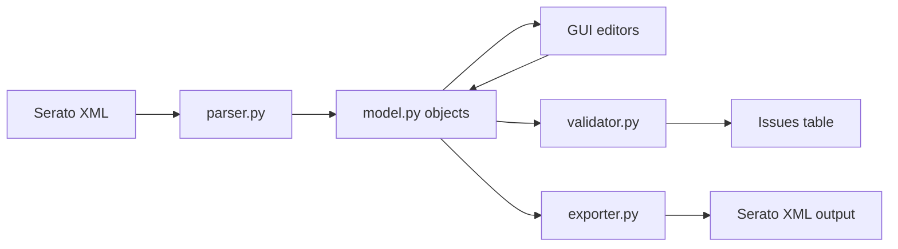
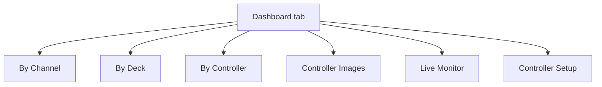

# Architecture

## Table of Contents

- [Overview](#overview)
- [Main Modules](#main-modules)
- [Data Flow](#data-flow)
- [GUI Navigation Model](#gui-navigation-model)
- [Controller Catalog Registry](#controller-catalog-registry)

## Overview

The application parses Serato MIDI XML into a typed model, lets users edit mappings in a Qt GUI, validates structural and mapping conflicts, and exports XML back to disk.

## Main Modules

- `src/djmidi/model.py`: dataclasses for `MidiConfig`, `Control`, `UserIO`, `MappingElement`, and translation aliases.
- `src/djmidi/parser.py`: XML -> model parser.
- `src/djmidi/exporter.py`: model -> XML writer.
- `src/djmidi/validator.py`: structural checks + mapping conflict checks.
- `src/djmidi/catalog/`: controller registry and controller lookup definitions.
- `src/djmidi/software/`: discoverable DJ software plugins, including Serato and Traktor parsers/exporters.
- `src/djmidi/gui/`: PySide6 UI.

## Data Flow

## GUI Navigation Model

The Dashboard tab acts as an entry dashboard: it lists known controllers, shows controller cards with MIDI availability, and emits drill-down actions into the other tabs.

## Controller Catalog Registry

The catalog is plugin-style:

- `_registry.py` stores `ControllerDefinition` and dynamic registration.
- One file per controller (`ddj_xp2.py`, `xdj_xz.py`, `ddj_1000.py`, etc.).
- `catalog/__init__.py` exposes the live API (`lookup`, `CONTROLLER_NAMES`, etc.).

Registration is dynamic, so newly applied definitions (from Controller Setup) can be used immediately in the current session.

## Integration detection and MIDI API

`djmidi.integration_detection` provides non-destructive, explainable
controller and mapping-software candidates. Results include a score, reasons,
an unknown/ambiguous/match status, and never silently change the active plugin.
The explicit user selection remains the fallback.

`djmidi.midi_api` defines the normalized desktop vocabulary: Web-MIDI-shaped
port identity/state plus raw MIDI 1.0 bytes, timestamps, port identity, SysEx
visibility, and parsing for the Universal MIDI Identity Reply. Controller
profiles may declare identity IDs and MIDI capabilities; the detection layer
uses those declarations to produce an explainable score. `midi_io.py` adapts
the native `mido/rtmidi` transport to that vocabulary without adding a browser
dependency. Routing and Clock mirror are implemented as separate engine modules
so their safety policies can evolve independently of detection.

The initial `midi_router.py` implementation provides one-way route graphs with
channel/message/SysEx filters, cycle prevention, and forwarding/error/drop
statistics. `midi_clock.py` separately mirrors Start, Continue, Stop, and 24
PPQN Clock realtime messages from a selected source. Jitter safeguards and
hardware-backed timing diagnostics remain disabled until their deterministic
tests are defined.

DJ software integrations use the same plugin principle. The software registry
exposes a parser, exporter, supported extensions, and display metadata. The
current UI asks the user to select the plugin when opening a mapping; automatic
detection is intentionally deferred until the mapping formats are sufficiently
distinct and reliable.

## MIDI API compatibility

The MIDI engine follows the concepts of the [W3C Web MIDI API](https://github.com/WebAudio/web-midi-api): access to named input/output ports, timestamped message events, explicit SysEx capability, and separate input/output operations. The desktop implementation remains native MIDI 1.0 through `mido/rtmidi`; the Web MIDI API is a compatibility model, not a browser runtime dependency. MIDI 2.0/UMP is reserved for a later adapter.
