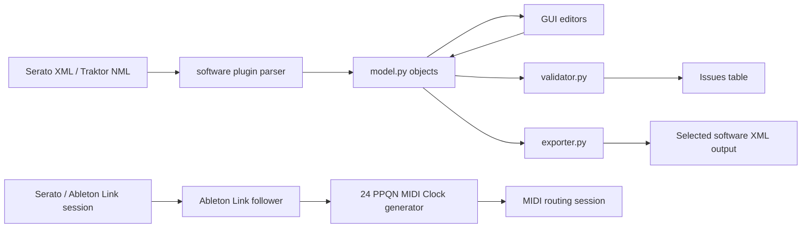
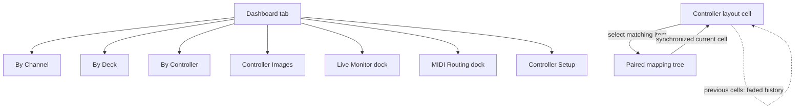

# Architecture

## Table of Contents

- [Overview](#overview)
- [Main Modules](#main-modules)
- [Data Flow](#data-flow)
- [GUI Navigation Model](#gui-navigation-model)
- [Controller Catalog Registry](#controller-catalog-registry)

## Overview

The application parses Serato MIDI XML and Traktor NML/XML into a typed model,
lets users edit mappings in a Qt GUI, validates structural and mapping
conflicts, and exports the selected software format back to disk.

## Main Modules

- `src/djmidi/model.py`: dataclasses for `MidiConfig`, `Control`, `UserIO`, `MappingElement`, and translation aliases.
- `src/djmidi/parser.py`: XML -> model parser.
- `src/djmidi/exporter.py`: model -> XML writer.
- `src/djmidi/validator.py`: structural checks + mapping conflict checks.
- `src/djmidi/catalog/`: controller registry and controller lookup definitions.
- `src/djmidi/software/`: discoverable DJ software plugins, including Serato and Traktor parsers/exporters.
- `src/djmidi/ableton_link.py`: optional Link state adapter and read-only 24 PPQN Clock follower.
- `src/djmidi/midi_clock.py`: physical MIDI Clock mirror and timing diagnostics.
- `src/djmidi/midi_routing_session.py`: opt-in physical MIDI route and Clock execution.
- `src/djmidi/gui/`: PySide6 UI.

## Data Flow

## GUI Navigation Model

The Dashboard tab acts as an entry dashboard: it lists known controllers in a three-column card grid, shows controller cards with MIDI availability, and emits drill-down actions into the mapping tabs or MIDI tool docks. Live Monitor and MIDI Routing are independent closable/floating docks. In By Channel, By Deck, and By Controller, clicking a DJ-oriented layout control keeps the originating tab active and selects the corresponding tree item when it represents a mapped control. XDJ-XZ and DDJ-XP2 use dedicated physical zones; display-only continuous controls are clearly separate from catalog mappings. The current cell is strongly highlighted while a short faded history remains visible in the layout.

## Controller Catalog Registry

The catalog is plugin-style:

- `_registry.py` stores `ControllerDefinition` and dynamic registration.
- One file per controller (`ddj_xp2.py`, `xdj_xz.py`, `ddj_1000.py`,
  `ddj_flx4.py`, `ddj_flx10.py`, `ddj_rev1.py`, etc.).
- `catalog/__init__.py` exposes the live API (`lookup`, `CONTROLLER_NAMES`, etc.).

Registration is dynamic, so newly applied definitions (from Controller Setup) can be used immediately in the current session.
The registry keeps the complete discovered set for Preferences while exposing
an active filtered set to selectors, detection, lookup, and parser selection;
the filter is driven by `PluginPreferences`.

## Integration detection and MIDI API

`djmidi.integration_detection` provides non-destructive, explainable
controller and mapping-software candidates. Results include a score, reasons,
and an unknown/ambiguous/match status. High-confidence matches can activate
the corresponding controller views or mapping parser; ambiguous results still
follow the persisted `ask`/`suggest` detection policy and explicit selection
remains the fallback.

`djmidi.midi_api` defines the normalized desktop vocabulary: Web-MIDI-shaped
port identity/state plus raw MIDI 1.0 bytes, timestamps, port identity, SysEx
visibility, and parsing for the Universal MIDI Identity Reply. Controller
profiles may declare identity IDs and MIDI capabilities; the detection layer
uses those declarations to produce an explainable score. `midi_io.py` adapts
the native `mido/rtmidi` transport to that vocabulary without adding a browser
dependency. Routing and Clock mirror are implemented as separate engine modules
so their safety policies can evolve independently of detection.

The initial `midi_router.py` implementation provides one-way route graphs with
channel/message/SysEx filters, cycle prevention, and forwarding/error/drop
statistics. `midi_clock.py` separately mirrors Start, Continue, Stop, and 24
PPQN Clock realtime messages from a selected physical source, rejects
implausibly short intervals, and reports observed jitter. `ableton_link.py` is
an optional read-only follower: it reads Link tempo/phase, never writes Link
tempo, and generates the same MIDI realtime transport and 24 PPQN ticks.
`midi_virtual.py` supplies a hardware-free port bus for deterministic route
tests; real hardware timing diagnostics remain a later integration concern.

`PluginPreferences` stores enabled plugin IDs and safety policies as a
backward-compatible JSON document. `PreferencesDialog` builds its plugin list
from the live controller and software registries, so external integrations do
not require GUI code changes.

`generic_profile.py` preserves learned channel/type/data values for an unknown
controller without assigning a guessed vendor layout. The resulting definition
can be registered explicitly for the current session when the user chooses to
work with that device.

`safe_update.py` provides the write-policy primitive for future configuration
updates: it validates the candidate text, exposes a unified diff, writes via a
temporary file after creating a backup, and can restore that backup explicitly.
The existing GUI save workflow will adopt it only after format-specific
integration tests are added.

DJ software integrations use the same plugin principle. The software registry
exposes a parser, exporter, supported extensions, and display metadata. The
current UI asks the user to select the plugin when opening a mapping; automatic
detection is intentionally deferred until the mapping formats are sufficiently
distinct and reliable.

## MIDI API compatibility

The MIDI engine follows the concepts of the [W3C Web MIDI API](https://github.com/WebAudio/web-midi-api): access to named input/output ports, timestamped message events, explicit SysEx capability, and separate input/output operations. The desktop implementation remains native MIDI 1.0 through `mido/rtmidi`; the Web MIDI API is a compatibility model, not a browser runtime dependency. MIDI 2.0/UMP is reserved for a later adapter.
