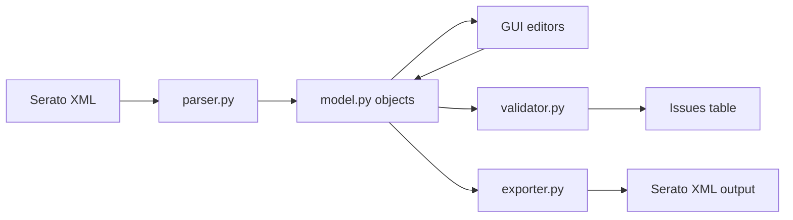

# Architecture

## Table of Contents

- [Overview](#overview)
- [Main Modules](#main-modules)
- [Data Flow](#data-flow)
- [GUI Navigation Model](#gui-navigation-model)
- [Controller Catalog Registry](#controller-catalog-registry)

## Overview

The application parses Serato MIDI XML into a typed model, lets users edit mappings in a Qt GUI, validates structural and mapping conflicts, and exports XML back to disk.

## Main Modules

- `src/djmidi/model.py`: dataclasses for `MidiConfig`, `Control`, `UserIO`, `MappingElement`, and translation aliases.
- `src/djmidi/parser.py`: XML -> model parser.
- `src/djmidi/exporter.py`: model -> XML writer.
- `src/djmidi/validator.py`: structural checks + mapping conflict checks.
- `src/djmidi/catalog/`: controller registry and controller lookup definitions.
- `src/djmidi/gui/`: PySide6 UI.

## Data Flow

## GUI Navigation Model

The Introduction tab now acts as an entry dashboard: it lists known controllers, shows controller cards, and emits drill-down actions into the other tabs.

## Controller Catalog Registry

The catalog is plugin-style:

- `_registry.py` stores `ControllerDefinition` and dynamic registration.
- One file per controller (`ddj_xp2.py`, `xdj_xz.py`, `ddj_1000.py`, etc.).
- `catalog/__init__.py` exposes the live API (`lookup`, `CONTROLLER_NAMES`, etc.).

Registration is dynamic, so newly applied definitions (from Controller Setup) can be used immediately in the current session.
