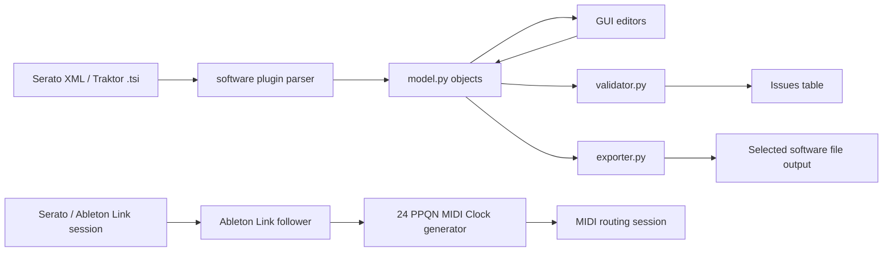
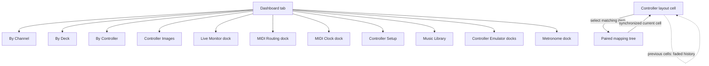
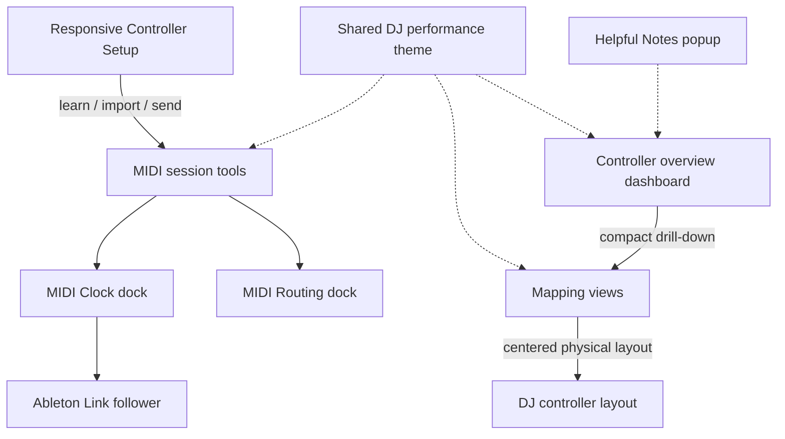

# Architecture

> 🧱 **Design at a glance:** typed mapping data flows through parsers,
> validators, GUI views, MIDI services, and safe exporters.

📍 [Docs](../../README.md) › [Developer](../README.md) › [Design](README.md) › Architecture

## Table of Contents

- [Overview](#overview)
- [Main Modules](#main-modules)
- [Data Flow](#data-flow)
- [GUI Navigation Model](#gui-navigation-model)
- [Recent UI and tool evolution](#recent-ui-and-tool-evolution)
- [Controller Catalog Registry](#controller-catalog-registry)
- [Integration detection and MIDI API](#integration-detection-and-midi-api)
- [Music library](#music-library)
- [MIDI API compatibility](#midi-api-compatibility)

## Overview

The application parses Serato MIDI XML and Traktor `.tsi` controller mappings
into a typed model, lets users edit mappings in a Qt GUI, validates structural
and mapping conflicts, and exports the selected software format back to disk.
Around that core sit the controller catalog, a MIDI engine (monitoring,
routing, Clock, Sync), and a separate music-library domain. Every service
except `gui/` is Qt-free; the [developer index](../README.md#services-at-a-glance)
lists them by responsibility.

## Main Modules

- `src/djmidi/model.py`: dataclasses for `MidiConfig`, `Control`, `UserIO`, `MappingElement`, and translation aliases.
- `src/djmidi/parser.py`: XML -> model parser.
- `src/djmidi/exporter.py`: model -> XML writer.
- `src/djmidi/validator.py`: structural checks + mapping conflict checks.
- `src/djmidi/catalog/`: controller registry and controller lookup definitions.
- `src/djmidi/safe_update.py`: validated, diffed, backed-up, atomic saves with rollback.
- `src/djmidi/software/`: discoverable DJ software plugins (Serato XML, Traktor `.tsi` via `_tsi.py`).
- `src/djmidi/binary_chunks.py`: format-agnostic "tag + size" chunk codec used by the `.tsi` codec.
- `src/djmidi/catalog/codegen.py`, `community.py`: Controller Setup's profile generation and community submission payloads.
- `src/djmidi/plugins/`: manifests, discovery/trust lifecycle, `PluginPreferences`.
- `src/djmidi/integration_detection.py`: explainable software/controller detection.
- `src/djmidi/midi_api.py`, `midi_io.py`: normalized MIDI 1.0 vocabulary and the `mido`/`rtmidi` adapter (monitoring, virtual monitor port).
- `src/djmidi/midi_router.py`: one-way route graphs with filters, transforms and cycle prevention.
- `src/djmidi/controller_sync.py`: per-controller initialization sets, port resolution, sending.
- `src/djmidi/library/`: music-library index, scan, tags, analysis, playlists, Serato/Traktor/Rekordbox library formats.
- `src/djmidi/taxonomy/`: genre family/category registry with aliases and fuzzy suggestions.
- `src/djmidi/ableton_link.py`: Link state adapter and read-only 24 PPQN Clock follower.
- `src/djmidi/midi_clock.py`: physical MIDI Clock mirror and timing diagnostics.
- `src/djmidi/midi_routing_session.py`: opt-in physical MIDI route and Clock execution.
- `src/djmidi/gui/`: PySide6 UI (tabs, tool docks, layouts and geometry, Controller Emulator, Music Library).

## Data Flow

## GUI Navigation Model

The Dashboard tab acts as an entry dashboard: it lists known controllers in a three-column card grid, shows controller cards with MIDI availability, and emits drill-down actions into the mapping tabs or MIDI tool docks. Live Monitor, MIDI Routing, MIDI Clock, and Metronome are independent closable/floating docks. MIDI Routing retains the shared routing session, MIDI Clock presents its configuration and diagnostics in its own surface, and Metronome is a loop-oriented MIDI session player driven by the current Controller Setup session. In By Channel, By Deck, and By Controller, clicking a schematic cell keeps the originating tab active and selects the corresponding tree item. The current cell is strongly highlighted while a short faded history remains visible in the layout.

### Recent UI and tool evolution

The three MIDI tools share safe session ownership but remain independently
closable and floatable. The theme is applied at the application level so new
dialogs and docks inherit the same visual language. Helpful Notes is kept out of
the dashboard layout to preserve the workspace for mapping tasks.

## Controller Catalog Registry

The catalog is plugin-style:

- `_registry.py` stores `ControllerDefinition` and dynamic registration.
- One file per controller (`ddj_xp2.py`, `xdj_xz.py`, `ddj_1000.py`,
  `ddj_flx4.py`, `ddj_flx10.py`, `ddj_rev1.py`, etc.).
- `catalog/__init__.py` exposes the live API (`lookup`, `CONTROLLER_NAMES`, etc.).

Registration is dynamic, so newly applied definitions (from Controller Setup) can be used immediately in the current session.
The registry keeps the complete discovered set for Preferences while exposing
an active filtered set to selectors, detection, lookup, and parser selection;
the filter is driven by `PluginPreferences`.

## Integration detection and MIDI API

`djmidi.integration_detection` provides non-destructive, explainable
controller and mapping-software candidates. Results include a score, reasons,
and an unknown/ambiguous/match status. High-confidence matches can activate
the corresponding controller views or mapping parser; ambiguous results still
follow the persisted `ask`/`suggest` detection policy and explicit selection
remains the fallback.

`djmidi.midi_api` defines the normalized desktop vocabulary: Web-MIDI-shaped
port identity/state plus raw MIDI 1.0 bytes, timestamps, port identity, SysEx
visibility, and parsing for the Universal MIDI Identity Reply. Controller
profiles may declare identity IDs and MIDI capabilities; the detection layer
uses those declarations to produce an explainable score. `midi_io.py` adapts
the native `mido/rtmidi` transport to that vocabulary without adding a browser
dependency. Routing and Clock mirror are implemented as separate engine modules
so their safety policies can evolve independently of detection.

The initial `midi_router.py` implementation provides one-way route graphs with
channel/message/SysEx filters, cycle prevention, and forwarding/error/drop
statistics. `midi_clock.py` separately mirrors Start, Continue, Stop, and 24
PPQN Clock realtime messages from a selected physical source, rejects
implausibly short intervals, and reports observed jitter. `ableton_link.py` is
a read-only follower: it reads Link tempo/phase, never writes Link
tempo, and generates the same MIDI realtime transport and 24 PPQN ticks.
`midi_virtual.py` supplies a hardware-free port bus for deterministic route
tests; real hardware timing diagnostics remain a later integration concern.

The runtime treats physical MIDI startup and shutdown as transactional: a
partially opened session closes every endpoint and resets Clock activity before
returning control, while one unavailable Clock destination does not interrupt
healthy destinations. GUI monitoring and learning likewise clean up partial
starts. Safe configuration updates refuse a second apply and correctly remove
a newly created file when rolled back.

`PluginPreferences` stores enabled plugin IDs and safety policies as a
backward-compatible JSON document. `PreferencesDialog` builds its plugin list
from the live controller and software registries, so external integrations do
not require GUI code changes.

`generic_profile.py` preserves learned channel/type/data values for an unknown
controller without assigning a guessed vendor layout. The resulting definition
can be registered explicitly for the current session when the user chooses to
work with that device.

`safe_update.py` is the write policy behind `File → Save`: it validates the
candidate text, exposes a unified diff (with an optional software-specific
summary, e.g. re-assigned Traktor bindings), writes via a temporary file after
creating a backup, and can restore that backup (`File → Rollback Last Save`).

DJ software integrations use the same plugin principle. The software registry
exposes a parser, exporter, supported extensions, and display metadata. When
a mapping is opened, `integration_detection` scores the file signature; the
persisted `ask`/`suggest` policy decides whether a confident match is applied
or confirmed, and an ambiguous one always falls back to explicit selection.

## Music library

`library/` is a separate domain from MIDI mappings. `db.py`'s SQLite index
records only paths, sizes, mtimes and a tag cache; `scanner.py` walks roots
incrementally; `metadata.py` reads and writes a fixed allowlist of tags
surgically (Serato/Traktor frames are never rewritten); `analysis.py` maps
keys to Camelot and optionally estimates BPM/key with `librosa`;
`playlist.py` sorts and matches harmonically; `serato_library.py`,
`traktor_library.py` and `rekordbox_library.py` read (and, for crates and
playlist `.nml`, write new) DJ-software library files; `workspace.py` holds
every non-widget decision of the Music Library tab. `taxonomy/` resolves
genre categories from folder, crate and tag hints.

## MIDI API compatibility

The MIDI engine follows the concepts of the [W3C Web MIDI API](https://github.com/WebAudio/web-midi-api): access to named input/output ports, timestamped message events, explicit SysEx capability, and separate input/output operations. The desktop implementation remains native MIDI 1.0 through `mido/rtmidi`; the Web MIDI API is a compatibility model, not a browser runtime dependency. MIDI 2.0/UMP is reserved for a later adapter.
