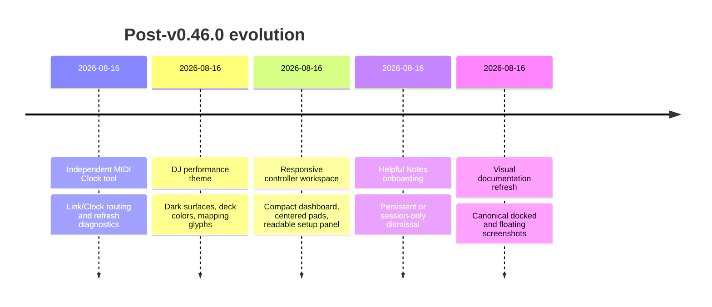
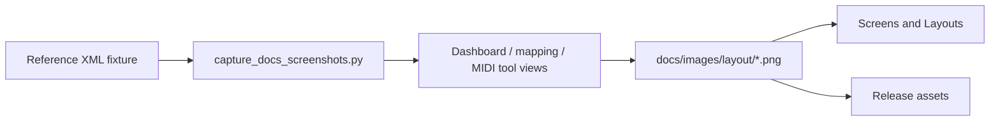

# Recent Evolution Chapters 📚

> A chronological, user-facing record of the work delivered after the
> `v0.46.0` release baseline.

## Table of Contents

- [How to read this page](#how-to-read-this-page)
- [Evolution map](#evolution-map)
- [Chapter 1: independent MIDI Clock](#chapter-1-independent-midi-clock)
- [Chapter 2: DJ performance language](#chapter-2-dj-performance-language)
- [Chapter 3: responsive controller workspace](#chapter-3-responsive-controller-workspace)
- [Chapter 4: helpful onboarding](#chapter-4-helpful-onboarding)
- [Chapter 5: reproducible visual documentation](#chapter-5-reproducible-visual-documentation)
- [Validation boundary](#validation-boundary)

## How to read this page

Each chapter links the user-visible result to its implementation area, tests,
documentation, and reference screenshots. Commit hashes are included as
stable local anchors for maintainers; milestone tags are added when a chapter
is coherent enough to be reviewed independently.

## Evolution map

## Chapter 1: independent MIDI Clock

The MIDI Clock configuration and diagnostics now live in their own closable,
movable, and floating tool. The shared routing session remains responsible for
safe endpoint ownership, while the Clock surface exposes source activity,
destination policy, refresh controls, and the `Ableton Link (DJ MIDI Studio)`
source.

- Code: `src/djmidi/ableton_link.py`, `midi_clock.py`,
  `midi_routing_session.py`, and `gui/midi_routing_view.py`.
- Docs: [MIDI Clock compatibility](../midi-clock-compatibility.md),
  [Screens and Layouts](../screens-and-layouts.md).
- Tests: `tests/test_midi_routing_view.py` and the Clock/router test modules.
- Visual references: `midi-clock.png`, `midi-clock-floating.png`, and
  `midi-tools-docked.png`.

## Chapter 2: DJ performance language

The application surface now uses a consistent dark performance theme across
the main window, menus, dialogs, tabs, docks, mapping trees, and controller
layouts. Layout cells use distinct pad, button, knob, fader, jog, deck, and
section cues while retaining the generic fallback for unknown devices.

- Code: `src/djmidi/gui/theme.py`, `layout_view.py`, and `main_window.py`.
- Docs: [Architecture](../architecture.md), [User Guide](../user-guide.md),
  and [Screens and Layouts](../screens-and-layouts.md).
- Tests: `tests/test_layout.py` and GUI navigation coverage.
- Visual references: `by-deck.png`, `by-controller.png`, and `dashboard.png`.

## Chapter 3: responsive controller workspace

The Dashboard gives each registered controller a spacious overview with a
reference image and compact vertical drill-down actions. Controller Setup keeps
learning/import/export above a full-width MIDI Output panel. The pad bank is
centered in its initial layout viewport, and selectors can scroll horizontally
without forcing oversized windows.

- Code: `introduction_view.py`, `controller_setup.py`, `layout.py`, and
  `layout_view.py`.
- Docs: [Screens and Layouts](../screens-and-layouts.md) and
  [User Guide](../user-guide.md).
- Tests: `tests/test_introduction_view.py` and `tests/test_layout.py`.
- Visual references: `dashboard.png`, `controlleur-setup.png`,
  `controlleur-image.png`, and `by-controller.png`.

## Chapter 4: helpful onboarding

Helpful Notes is a dedicated startup popup rather than a permanent dashboard
panel. Users can reopen it from `View -> Helpful Notes...` and choose whether
closing it applies only to the current session or to future startups.

- Code: `src/djmidi/gui/helpful_notes_dialog.py` and `main_window.py`.
- Docs: [User Guide](../user-guide.md) and [Screens and Layouts](../screens-and-layouts.md).
- Validation: GUI tests plus manual verification of persistent and session-only
  dismissal.

## Chapter 5: reproducible visual documentation

The screenshot generator uses the reference XML and offline MIDI monitors to
capture stable compositions without physical hardware. It covers each mapping
surface, all three MIDI tools, the all-docked arrangement, and each floating
tool. Arbitrary user-specific dock geometries remain intentionally out of scope.

Run it with `QT_QPA_PLATFORM=offscreen` in a configured development
environment. See the [Layout Screenshot Index](../images/layout/README.md).

## Validation boundary

These chapters are software- and fixture-validated. The Serato → CoreMIDI
virtual-port Clock path has since been verified on real macOS/Serato hardware
with a physical controller (see [TODO.md](../../TODO.md) → Phase 3 hardware
validation and [#10](https://github.com/guillain/DJ-MIDI-Studio/issues/10));
the direct `Ableton Link (DJ MIDI Studio)` → CoreMIDI follower path remains
open. Screenshots demonstrate layout and state presentation; they are not
evidence of hardware compatibility.
