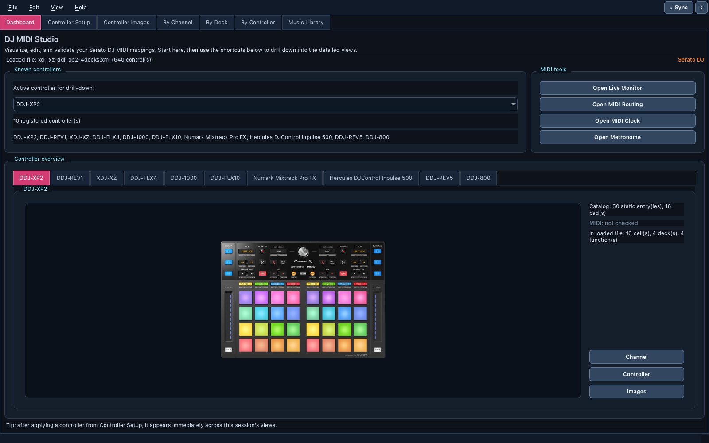
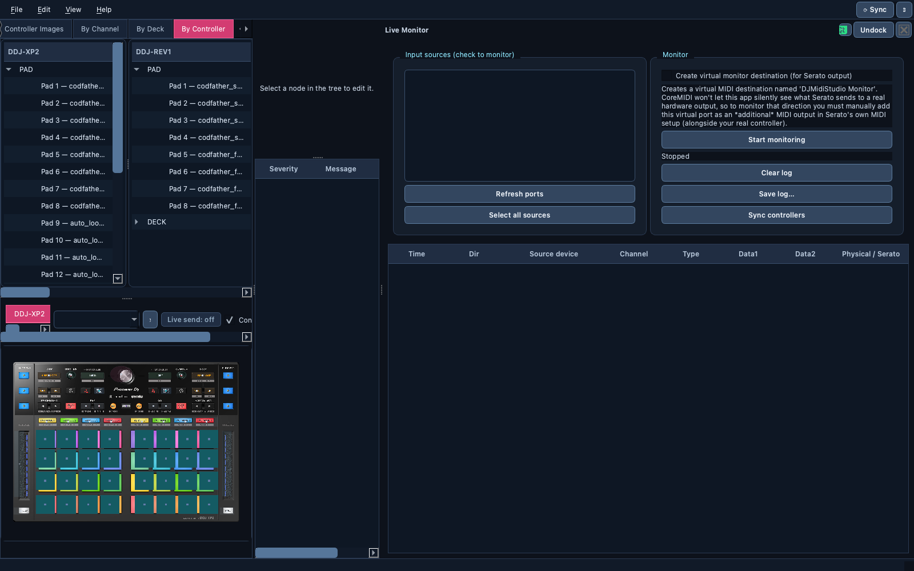
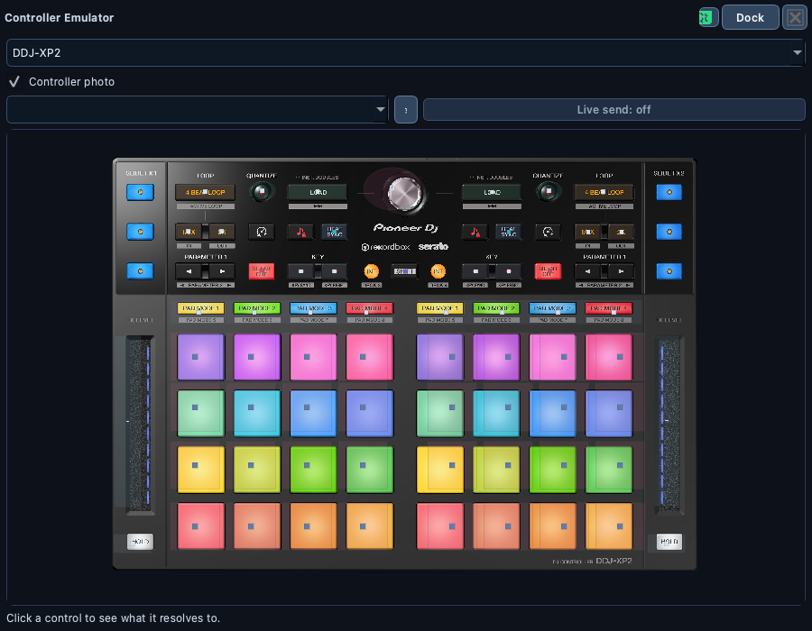

# 🎧 DJ MIDI Studio for DJs

> Everything you can do with DJ MIDI Studio, feature by feature: set up and
> sync your controllers, watch your MIDI live, organize your music, and play
> your controller on screen.

📍 [Docs](../README.md) › End user

## Table of Contents

- [Highlights](#highlights)
- [Also in the box](#also-in-the-box)
- [Get started](#get-started)
- [In this section](#in-this-section)

## Highlights

### 🎛️ Controller Setup and ⟳ Sync

Teach the app **any** MIDI controller by pressing its buttons, or by
importing a Serato mapping you already use. Name the controls, apply, and
the controller shows up everywhere. Then record the buttons you always press
after plugging in, and bring **every connected controller** to that state
with one click on `⟳ Sync`.

→ [Controller Setup](features/controller-setup.md) ·
[Controller Sync](features/controller-sync.md)

### 📡 Live Monitor

Every MIDI message, already translated into the physical control (`PAD ·
Pad 3`) and the DJ-software function it triggers. As you play, the whole app
reacts: pads flash, knobs turn, held buttons glow, jog wheels spin, and even
Serato's LED feedback lights up on screen.

→ [Live Monitor](features/live-monitor.md)

### 🎵 Music Library

Scan tens of thousands of tracks without freezing, fix tags on a whole
selection in one step, read every key on the Camelot wheel, sort tracks into
genre categories that follow your own folders and crates, and generate
harmonic playlists exported to Serato crates or Traktor playlists. Serato
and Traktor data inside your files is never touched.

→ [Music Library](features/music-library.md)

### 🕹️ Controller Emulator

A clickable twin of your controller, drawn on its real photo. Click a pad to
see exactly what the mapping does; switch pad modes, latch SHIFT, turn the
knobs — and switch on `Live send` to play your DJ software from the screen.
Open several, one per controller.

→ [Controller Emulator](features/controller-emulator.md)

## Also in the box

| | Feature | In one line |
| --- | --- | --- |
| 🗺️ | [Mapping editor](features/mapping-editor.md) | Serato mappings by channel, deck or physical control; safe edits, validation, diff before save |
| 🎧 | [Traktor mappings](features/traktor-mappings.md) | Open Traktor `.tsi` mappings and re-assign MIDI triggers |
| 🖼️ | [Controller Images](features/controller-images.md) | Official diagrams and manuals, offline |
| 🔀 | [MIDI Routing, Clock and Metronome](features/midi-routing-and-clock.md) | Route MIDI, MIDI Clock from Ableton Link, MIDI loops |
| 🪟 | [Workspace and preferences](features/workspace.md) | Dockable tools, Performance Mode, Preferences |

Supported out of the box: Serato DJ Pro and Traktor mappings; DDJ-XP2,
XDJ-XZ, DDJ-1000, DDJ-FLX4, DDJ-FLX10, DDJ-REV1, DDJ-REV5, DDJ-800, Numark
Mixtrack Pro FX and Hercules DJControl Inpulse 500, Behringer CMD LC-1 — and any other
controller through Controller Setup. See
[Supported controllers](controller-profiles.md).

## Get started

1. Download the archive for your system from the
   [latest release](https://github.com/guillain/DJ-MIDI-Studio/releases/latest),
   unpack it and run `djmidi`. No Python needed.
2. Follow the [User guide](user-guide.md): first launch, opening a mapping,
   and the everyday workflow.
3. Pick a feature above, or try a ready-made recipe in
   [End-to-end examples](examples.md).

## In this section

| Page | What it covers |
| --- | --- |
| [User guide](user-guide.md) | Install, first launch, supported files, everyday workflow, logs, command-line MIDI |
| [Features](features/README.md) | One page per feature |
| [End-to-end examples](examples.md) | Step-by-step recipes |
| [Supported controllers](controller-profiles.md) | Built-in controllers, their sources and verification status, custom profiles |
| [MIDI Clock compatibility](midi-clock-compatibility.md) | What works with Serato, Traktor and Rekordbox, and why |
| [Plugins](plugins.md) | Installing and trusting external plugins |
