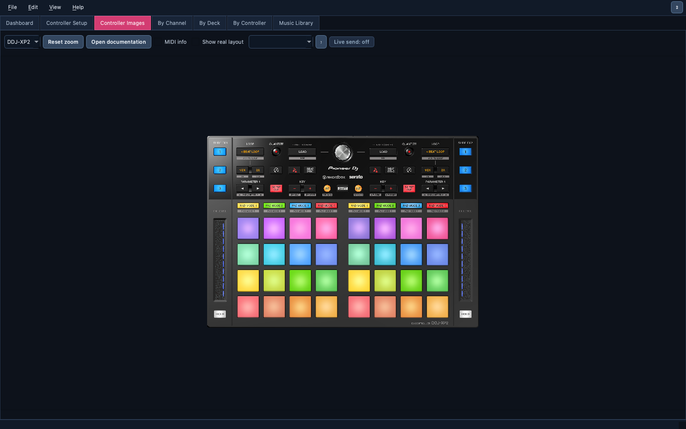

# 🖼️ Controller Images

> The official diagrams and manuals of every supported controller, zoomable
> and available offline, with an optional overlay of each control's real
> position.

📍 [Docs](../../README.md) › [End user](../README.md) › [Features](README.md) › Controller Images

## Table of Contents

- [What it does](#what-it-does)
- [Browse a controller](#browse-a-controller)
- [Display layers](#display-layers)
- [Related](#related)

## What it does

The `Controller Images` tab shows the reference picture of the selected
controller and opens its bundled manual or MIDI message list. Everything is
stored with the app, so it works without an internet connection.

## Browse a controller

Pick a controller, then zoom with the mouse wheel, drag to pan, and
`Reset zoom` to fit. `Open documentation` opens its PDF. A controller
without artwork shows a placeholder instead of a wrong picture; a
controller built in [Controller Setup](controller-setup.md) can carry your
own image.

The same documents are in `Help → Controller References`.

## Display layers

Every controller view (this tab, the `By Channel` / `By Deck` /
`By Controller` drawings and every [Controller
Emulator](controller-emulator.md)) has the same three layer checkboxes:

| Layer | Shows |
| --- | --- |
| `Controller` | The real photo of the controller |
| `MIDI` | The same controller with its MIDI message list callouts printed on it, when it ships one |
| `Layout` | The app's MIDI layout: a marker on every modeled control at its true position |

Only one photo shows at a time: ticking `MIDI` unticks `Controller` and the
other way round, and both can be off. The layout was measured on the
`Controller` photo, so it is greyed out while `MIDI` is shown. That gives
photo only, layout only, photo + layout, or the MIDI picture alone. Here the
layout starts off; in the other views it starts on, over the photo.

Nine controllers have a measured layout: DDJ-XP2, XDJ-XZ, DDJ-1000,
DDJ-FLX10, DDJ-REV1, Numark Mixtrack Pro FX, Behringer CMD Micro and
CMD Studio 4a, and Korg nanoPAD2, with both decks where the controller has
two. Others show their photo here, and a grid in the other views.

With the [Live Monitor](live-monitor.md) running, a marker flashes when you
hit that control on the hardware, a jog marker turns with the platter, and
LED messages from Serato light it amber.

## Related

- [Supported controllers](../controller-profiles.md)
- [Controller Emulator](controller-emulator.md)
