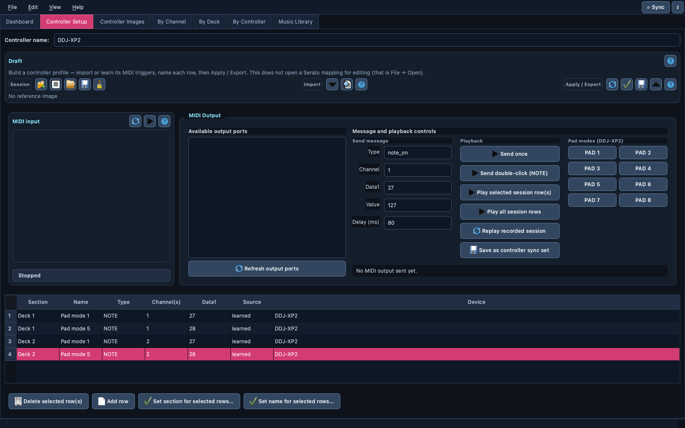
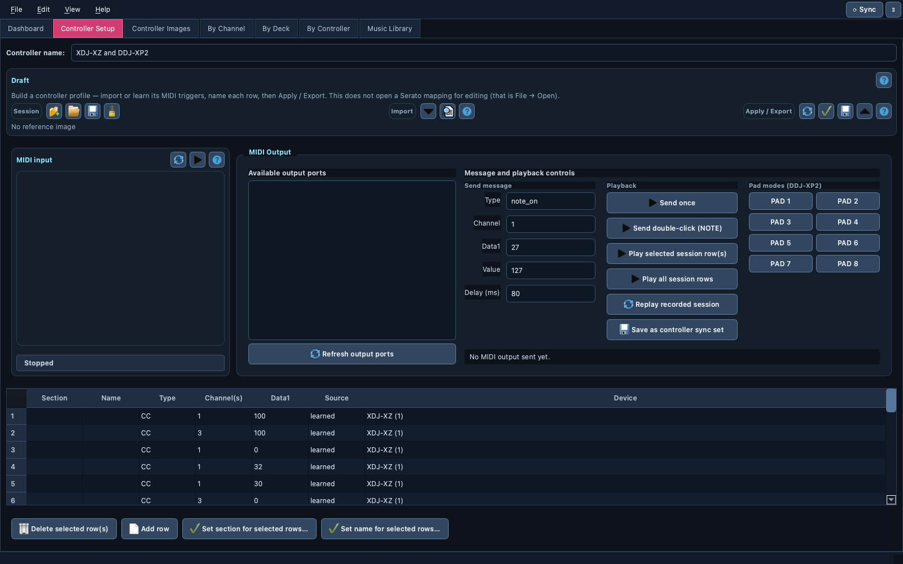

# 🎛️ Controller Setup

> Turn any MIDI controller into a named, browsable profile in minutes: press
> its buttons (or import a mapping you already have), name them, and use it
> across the whole app. No manufacturer documentation needed.

📍 [Docs](../../README.md) › [End user](../README.md) › [Features](README.md) › Controller Setup

## Table of Contents

- [What it does](#what-it-does)
- [Build a profile in five steps](#build-a-profile-in-five-steps)
- [Start from a controller the app already knows](#start-from-a-controller-the-app-already-knows)
- [Learn from the hardware](#learn-from-the-hardware)
- [Learn triggers from an existing mapping](#learn-triggers-from-an-existing-mapping)
- [Label many controls at once](#label-many-controls-at-once)
- [Send MIDI back to the controller](#send-midi-back-to-the-controller)
- [Use the profile: apply, export, share](#use-the-profile-apply-export-share)
- [Sessions](#sessions)
- [Related](#related)

## What it does

A *controller profile* maps each MIDI trigger a device sends (channel, note
or CC, number) to a readable physical name such as `DECK · PLAY` or
`PAD · Pad 3`. Once a controller has a profile, every view in the app speaks
its language: the mapping editor, the [Live Monitor](live-monitor.md), the
[Controller Emulator](controller-emulator.md), and [Sync](controller-sync.md).

Ten controllers ship with a profile already (see
[Supported controllers](../controller-profiles.md)). Controller Setup is how
you add **any other one** — a Behringer, a Korg pad, a home-made box —
without waiting for official MIDI documentation.

Controller Setup builds a controller *profile*, not a Serato or Traktor
mapping. To edit a mapping, use `File → Open Mapping…` and the
[mapping editor](mapping-editor.md).

## Build a profile in five steps

1. Plug in the controller and open the `Controller Setup` tab.
2. Type the controller's name in the `Draft` toolbar.
3. In `MIDI input`, tick the controller's port and click `Start learning`.
4. Press every button and pad you care about. Each new trigger appears once
   in the table, even if you press it again.
5. Fill in each row's **Section** and **Name**, then `Apply now` to use the
   profile right away.

## Start from a controller the app already knows

`Start from controller…` (in the `Session` group) replaces the draft with
every control of a controller already in the catalog — sections, names, and
the pads of every pad mode — under the name `<controller> (copy)`. Rename,
delete or add rows, then apply or export. The copy keeps its own name, so
applying it never replaces the built-in controller.

## Learn from the hardware

While learning, every Note or CC the controller sends is added as a row:
section, name, type (`NOTE`/`CC`), channel(s), data value, source
(`learned` or `imported`) and device. Rows are de-duplicated on the raw
trigger, so pressing the same pad twice never creates a second row.

`Check for conflicts` flags any trigger that two differently named rows
both claim. It also runs automatically before applying or exporting.

## Learn triggers from an existing mapping

`Learn triggers from a mapping…` (in the `Learn` panel, or `File →
Controller Profile`) → choose a Serato `.xml` or a Traktor `.tsi` mapping to
seed the
table with every trigger it uses, so you don't have to press every button by
hand. Mapping files don't contain physical control names, so Section and
Name stay for you to fill in. Importing the same file twice adds nothing new.

A Traktor `.tsi` export often holds several devices, usually one per
controller (for example a CMD Studio 4a next to a CMD Micro). When it does,
you choose which device to import, or `All devices`; each row's **Device**
column names the Traktor device it came from.

After a successful import, the app offers to also open that file as an
editable mapping in `By Channel` / `By Deck` / `By Controller`.

## Label many controls at once

Select several rows (Shift/Cmd-click) and use:

- `Set section for selected rows…` to give them one section, for example
  `PAD`;
- `Set name for selected rows…` to give them one name, optionally
  auto-numbered across the selection (`PAD 1`, `PAD 2`, …).

Each bulk edit re-checks for conflicting triggers and warns immediately.

## Send MIDI back to the controller

The `MIDI Output` panel talks back to the hardware, which is useful to test
LEDs, switch pad modes, or initialize a device:

- **Available output ports** is a checklist; check several ports to send to
  all of them at once. One port is pre-checked by default.
- **Send message** sends one Note or CC, or a Note double-click.
- **Playback** replays the selected rows or the whole recorded session.
  `Save as controller sync set` turns the recording into a
  [Sync](controller-sync.md) set.
- **Pad modes** has one-click buttons for the eight DDJ-XP2 pad modes.

For repeated playback at a fixed rate, use the
[Metronome](midi-routing-and-clock.md#metronome).

## Use the profile: apply, export, share

| Action | What happens |
| --- | --- |
| `Apply now (this session)` | The controller appears immediately in every controller selector, layout and emulator. Not kept after a restart. |
| `Generate catalog module…` | Writes a Python profile file you (or a maintainer) can add to the app permanently. |
| `Attach reference image…` | Gives the controller a photo or diagram (PNG/JPG), shown in [Controller Images](controller-images.md). The image stays where it is on your disk. |
| `Submit to community catalog…` | Validates the profile, copies it as JSON to the clipboard and opens a pre-filled GitHub issue for you to review and post. Nothing is uploaded automatically, and images are never included. |

A profile can't be applied under the name of a built-in controller, so a
test draft can never overwrite, for example, the real DDJ-XP2 profile.

## Sessions

`Session` → `Save session…` / `Load session…` stores the draft (name, rows,
attached image) as a JSON file so you can continue later. The repository
ships recorded sessions for the DDJ-XP2 and XDJ-XZ in `data/controllers/`.

To pick up where you left off every time, set ⚙ Preferences →
`Controller Setup default file` to a session `.json`, a Serato `.xml` or a
Traktor `.tsi`. It is loaded the first time the tab is shown in a session, as
long as the draft is still empty (a mapping only seeds triggers, every device
of a `.tsi` included, without offering to open it as a mapping). A missing or unreadable file is skipped and logged.

## Related

- [Controller Sync](controller-sync.md): initialize every controller in one
  click.
- [Supported controllers](../controller-profiles.md): built-in profiles and
  their verification status.
- [Controller Emulator](controller-emulator.md): try the new profile on
  screen.
