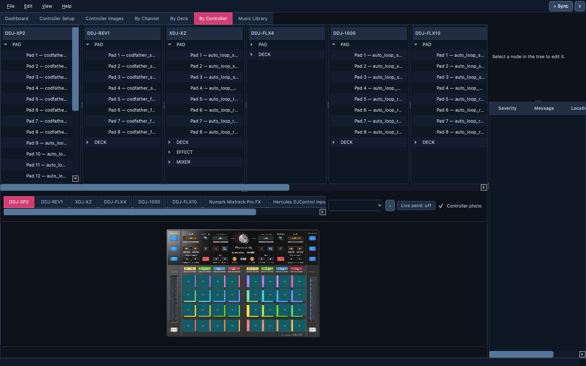
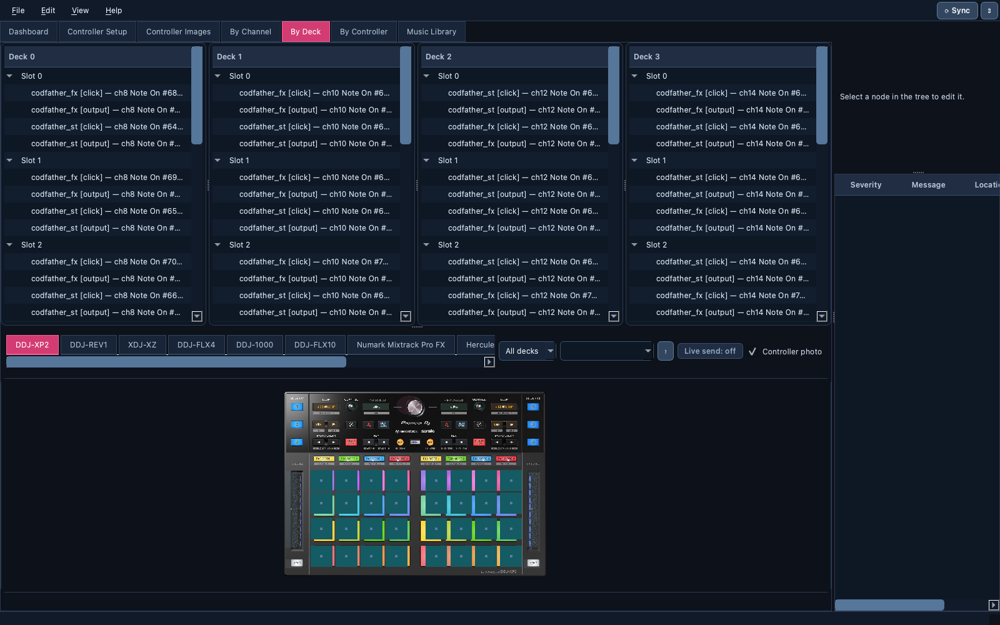
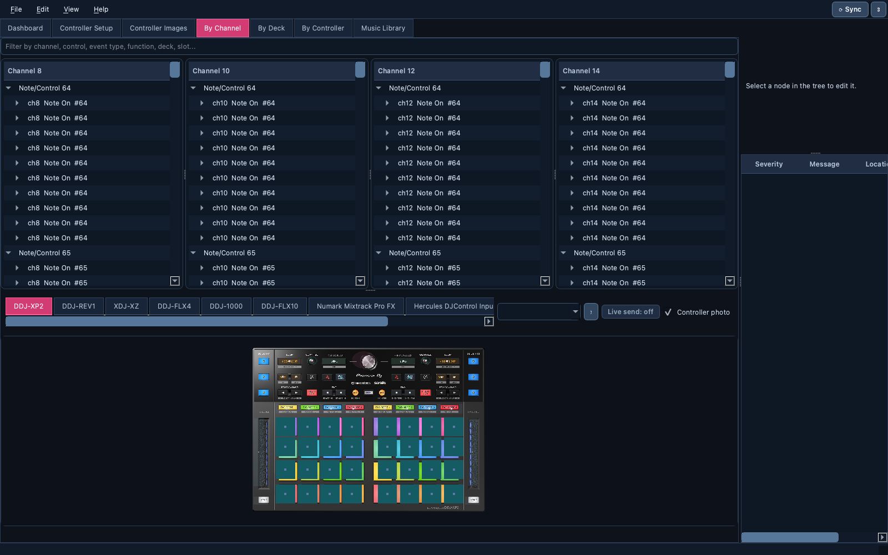

# 🗺️ Mapping editor

> Open a Serato or Traktor MIDI mapping and see it the way a DJ thinks: per
> channel, per deck, or per physical control. Edit safely, validate, and
> save a file your DJ software opens again.

📍 [Docs](../../README.md) › [End user](../README.md) › [Features](README.md) › Mapping editor

## Table of Contents

- [What it does](#what-it-does)
- [Open a mapping](#open-a-mapping)
- [Dashboard](#dashboard)
- [Three views of the same mapping](#three-views-of-the-same-mapping)
- [The controller layout](#the-controller-layout)
- [Edit safely](#edit-safely)
- [Validate and save](#validate-and-save)
- [Related](#related)

## What it does

A Serato mapping file can run to 16,000+ lines of XML. The mapping editor
parses it into decks, channels, controls and functions, shows it next to a
drawing of your controller, and keeps every edit undoable and validated.

## Open a mapping

`File → Open…` and choose a Serato `.xml` or Traktor `.tsi` mapping. The
app recognizes the format from the file's content; when it isn't sure, it
asks which software the file belongs to. The software is then shown as a
badge on the Dashboard (Serato in orange, Traktor in teal) and in the window
title.

Traktor `.tsi` files have their own page: [Traktor mappings](traktor-mappings.md).

## Dashboard

The first tab summarizes the loaded file and gives each registered
controller its own overview: reference picture, MIDI availability
(`MIDI: available` when a connected port matches the controller), and
shortcuts into the `Channel`, `Controller` and `Images` views.

## Three views of the same mapping

| View | Organized by | Use it to |
| --- | --- | --- |
| **By Channel** | MIDI channel → control → event → function | Inspect or fix one raw XML mapping precisely |
| **By Deck** | Serato deck → slot → function | Edit a function once for all its duplicate copies |
| **By Controller** | Controller → section (PAD, DECK, EFFECT…) → physical control | Find what a physical button does |

Each view shows one column per channel, deck or controller. When a mapping
uses more columns than fit, the row scrolls sideways instead of squeezing
them.

Selecting anything in one view highlights the matching controls in all
three layouts. Clicking a control in a layout jumps to its raw entry.

## The controller layout

Under each tree, a dark performance-style drawing of the controller shows
which controls are mapped, colored by deck. Pads, buttons, knobs, faders and
jog wheels have their own shapes. For the six controllers with measured
geometry (DDJ-XP2, XDJ-XZ, DDJ-1000, DDJ-FLX10, DDJ-REV1, Numark Mixtrack Pro
FX), controls sit at their true positions on the real controller photo
(`Controller photo` checkbox); other controllers use a tidy grid.

`By Deck` adds a deck filter to color only one deck. The last few selections
stay softly highlighted so you can follow where you've been. With the
[Live Monitor](live-monitor.md) running, the layouts also react to the real
hardware.

## Edit safely

The panel on the right edits the selected item; every change is undoable
(`Edit → Undo` / `Redo`).

Serato repeats each trigger several times in a mapping, and those copies
must stay identical, so deleting them breaks the mapping. In **By Deck**,
one edit updates every copy at once, so they can never drift apart. Prefer
it over editing copies one by one in By Channel.

## Validate and save

1. `Edit → Validate` checks the structure and looks for conflicts; results
   appear as errors, warnings and info in the right-hand panel. Duplicate
   copies are reported as *info* only, since they are expected.
2. `File → Save` or `Save As…` shows the exact changes (a diff) before
   writing. A backup is made and the file is written in one atomic step.
3. `File → Rollback Last Save` restores that backup.

An unedited file saves back byte-for-byte identical.

## Related

- [Traktor mappings](traktor-mappings.md)
- [Controller Emulator](controller-emulator.md): click through the mapping
  on an interactive controller.
- [Controller Setup](controller-setup.md): add a controller the app doesn't
  know yet.
