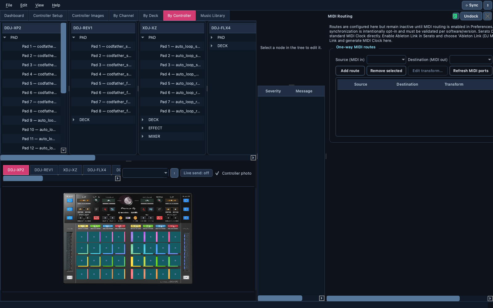
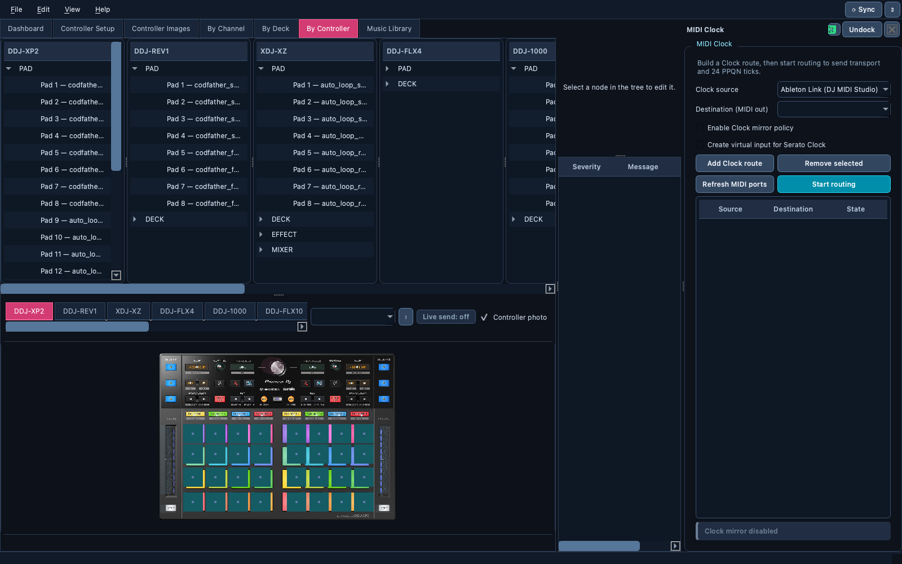
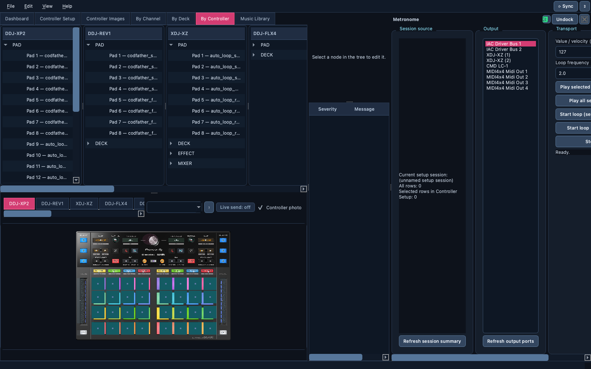

# 🔀 MIDI Routing, Clock and Metronome

> Forward MIDI between devices, turn Ableton Link tempo into a real 24 PPQN
> MIDI Clock for your hardware, and replay recorded MIDI on a loop.

📍 [Docs](../../README.md) › [End user](../README.md) › [Features](README.md) › MIDI Routing, Clock and Metronome

## Table of Contents

- [What it does](#what-it-does)
- [Turn routing on](#turn-routing-on)
- [MIDI Routing](#midi-routing)
- [MIDI Clock](#midi-clock)
- [Metronome](#metronome)
- [Related](#related)

## What it does

Three independent tool windows, opened from the `View` menu or the
Dashboard:

| Tool | Purpose |
| --- | --- |
| **MIDI Routing** | One-way routes from a MIDI input to a MIDI output, optionally transformed |
| **MIDI Clock** | Forward or generate MIDI Clock (Start/Stop/Continue + 24 ticks per beat) |
| **Metronome** | Replay recorded Controller Setup rows once or on a loop |

Their routes, ports and settings are restored at the next launch.

## Turn routing on

Routing touches real hardware, so it is **off by default**. Enable
`Enable MIDI routing policies` in ⚙ Preferences first. Only the ports used
by your routes are opened when you click `Start routing`, and
`Stop routing` closes them again. A port error stops the session safely.

## MIDI Routing

1. Pick a `Source (MIDI in)` and a `Destination (MIDI out)`.
2. `Add route`. Add as many as you need.
3. Optionally select a route and `Edit transform…` to remap the channel, add
   a note/CC offset or invert the value. The `Transform` column summarizes
   it, for example `Ch 3, +12, invert`.
4. `Start routing`.

Routes that would loop back on themselves are refused.

## MIDI Clock

Serato doesn't send MIDI Clock, but it does share its tempo over **Ableton
Link**. DJ MIDI Studio can follow Link and generate a real MIDI Clock for
drum machines, synths or effects:

1. Enable Link in Serato DJ Pro (or any Link app).
2. In `MIDI Clock`, tick `Enable Clock mirror policy`.
3. Choose `Ableton Link (DJ MIDI Studio)` as the source and your
   hardware's MIDI output as the destination, then `Add Clock route`.
4. `Start routing`.

DJ MIDI Studio follows Link's tempo and phase and never changes it. For
Start/Stop to follow too, another Link app with *Start Stop Sync* enabled
(for example Ableton Live) must be in the session: Serato shares tempo only.

You can also forward an existing Clock, for example Traktor's MIDI Clock
output, by choosing that MIDI input as the source.

The status line shows `CLOCK ACTIVE` when ticks are flowing and
`CLOCK INACTIVE` with the likely reason when they aren't. Read
[MIDI Clock compatibility](../midi-clock-compatibility.md) before relying
on it live.

## Metronome

The Metronome plays the rows captured in [Controller
Setup](controller-setup.md) to an output port: `Play selected setup row(s)
once`, `Play all setup rows once`, or start a loop at a chosen
`Loop frequency (Hz)` with a fixed `Value / velocity`. Handy to blink LEDs,
test a mapping, or keep a device awake.

## Related

- [MIDI Clock compatibility](../midi-clock-compatibility.md)
- [Live Monitor](live-monitor.md)
- [Workspace and preferences](workspace.md)
