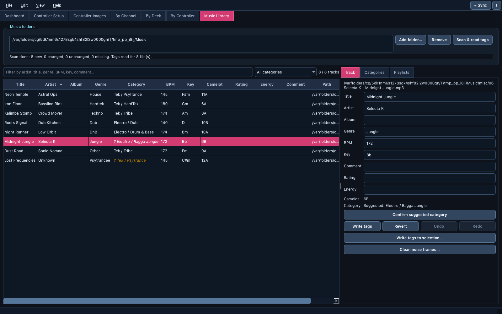
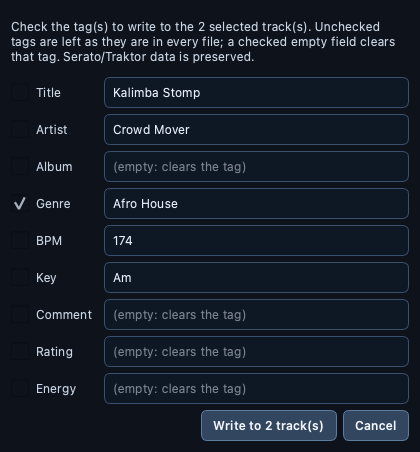
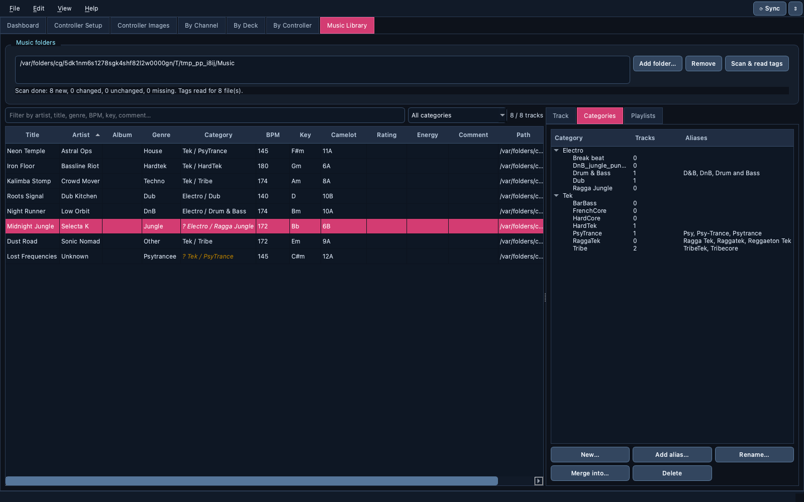
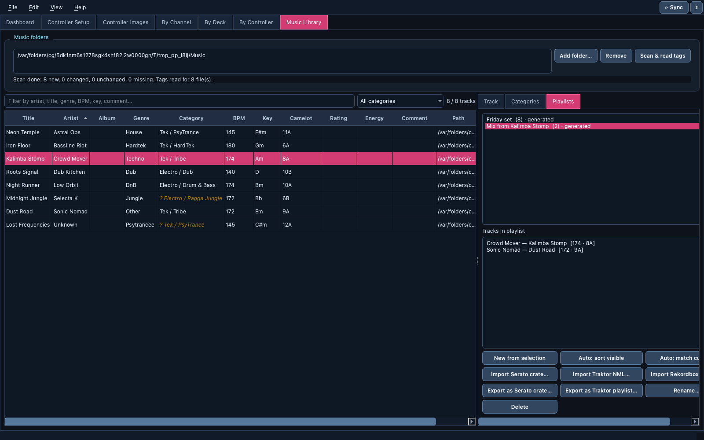

# 🎵 Music Library

> Get a messy collection mix-ready: scan your folders, fix tags in bulk,
> see every key on the Camelot wheel, sort tracks into genre categories, and
> build harmonic playlists you can export to Serato and Traktor.

📍 [Docs](../../README.md) › [End user](../README.md) › [Features](README.md) › Music Library

## Table of Contents

- [What it does](#what-it-does)
- [Scan your music](#scan-your-music)
- [Browse, sort and filter](#browse-sort-and-filter)
- [Edit tags](#edit-tags)
- [Write tags to many tracks at once](#write-tags-to-many-tracks-at-once)
- [Genre categories](#genre-categories)
- [Playlists](#playlists)
- [Import and export with DJ software](#import-and-export-with-dj-software)
- [Safety: what is never touched](#safety-what-is-never-touched)
- [Related](#related)

## What it does

The `Music Library` tab manages your own tracks, independently of any MIDI
mapping. It is built for large collections (tens of thousands of files)
and stays responsive while it works.

## Scan your music

1. `Add folder…` and pick one or more music folders.
2. Click `Scan & read tags`. A progress bar runs; the window stays usable.

Later scans only re-read files that changed. A file that disappears, for
example on an unplugged drive, is greyed out as *missing* instead of being
forgotten. MP3, WAV, AIFF, FLAC, M4A, OGG and AAC files are indexed.

The index lives beside the preferences file as `library.sqlite3`; it
records file paths, sizes, dates and a cache of the tags, never the audio.

## Browse, sort and filter

- Click a column header to sort (BPM sorts numerically).
- Type in the filter box to search titles, artists, genres, BPM, keys and
  comments.
- Pick a category in the category filter, or `Uncategorized`.

The **Camelot** column translates any key notation into the Camelot wheel
used for harmonic mixing: `Am`, `F#m`, Open Key `7m` and `8A` are all
understood.

## Edit tags

Select a track; the **Track** panel shows its title, artist, album, genre,
BPM, key, comment, rating and energy. Edit any field and click `Write tags`
(or press Enter). Only the changed fields are written to the file.

`Undo` / `Redo` write the previous values back. `Revert` discards edits you
haven't written yet. `Clean noise frames…` lists leftover junk tags (old
ID3v1 comment copies, old player preferences, ReplayGain values…) and
removes them only after you confirm.

## Write tags to many tracks at once

To give a whole album the same genre, or fix an artist name everywhere:

1. Select the tracks in the table (Shift-click for a range, Cmd/Ctrl-click
   to add tracks).
2. Optionally type the new values in the Track panel.
3. Click `Write tags to selection…`.
4. Tick the tag(s) to write. Each field starts with the Track panel's value,
   and the fields you just edited are already ticked. Unticked tags are left
   as they are in every file; a ticked empty field clears that tag.
5. Click `Write to N track(s)`.

Tracks that already have the value are skipped, the whole batch is a single
`Undo` step, and a file that can't be written is reported at the end
without stopping the others.

## Genre categories

Tracks are sorted into two-level categories, `Family / Name` (for example
`Tek / PsyTrance`), using your folder names and Serato crate names first,
then the genre tag, since a genre tag alone is often wrong.

- A category shown in amber as `? Tek / PsyTrance` is only a
  **suggestion** from a near-match spelling. Select the track and click
  `Confirm suggested category` to make that spelling a permanent alias.
  Suggestions are never applied on their own.
- The **Categories** panel shows track counts and lets you create, rename,
  merge and delete categories and aliases (`DnB`, `D&B` and `Drum and Bass`
  can all mean `Drum & Bass`).

## Playlists

The **Playlists** panel:

| Button | Result |
| --- | --- |
| `New from selection` | A playlist of the selected rows |
| `Auto: sort visible` | Every visible row, grouped by category, then BPM range, then key |
| `Auto: match current` | The selected track followed by every visible track within ±6 % BPM and a harmonically compatible Camelot key |
| `Rename…` / `Delete` | Manage the selected playlist |

## Import and export with DJ software

| Software | Import (read-only) | Export |
| --- | --- | --- |
| Serato | `Import Serato crate…` (`_Serato_/Subcrates/*.crate`) | `Export as Serato crate…` writes a new `.crate` where you choose; copy it into `_Serato_/Subcrates` yourself |
| Traktor | `Import Traktor NML…` (playlists of `collection.nml`) | `Export as Traktor playlist…` writes a new `.nml`; in Traktor, right-click `Playlists` → `Import Playlist` |
| Rekordbox | `Import Rekordbox export…` (USB `PIONEER/rekordbox/export.pdb`) | — |

Imported Serato crate names also help categorize tracks.

## Safety: what is never touched

- Tag writes change only the fields you edit. Serato and Traktor data stored
  inside your audio files (cue points, beat grids, analysis) is preserved.
- Serato, Traktor and Rekordbox library files are only ever read. Exports
  always create a new file at the location you choose.
- Undo writes the old values back through the same careful path.

## Related

- [Supported files](../user-guide.md#supported-files)
- [Mapping editor](mapping-editor.md)
