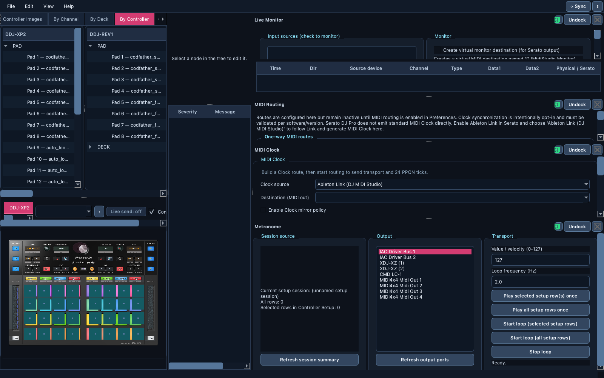
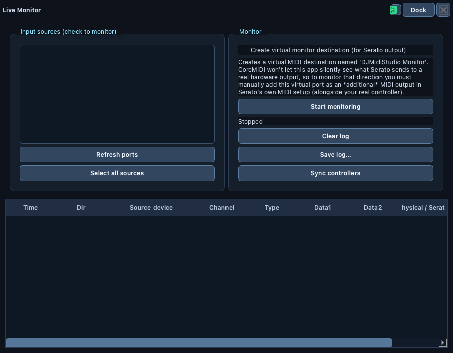

# 🪟 Workspace and preferences

> Arrange tabs and tool windows the way you play, switch to a stage-friendly
> view, and set the app's behavior in one Preferences dialog.

📍 [Docs](../../README.md) › [End user](../README.md) › [Features](README.md) › Workspace and preferences

## Table of Contents

- [Tabs and tool windows](#tabs-and-tool-windows)
- [Window controls](#window-controls)
- [Performance Mode](#performance-mode)
- [Preferences](#preferences)
- [Helpful Notes and Help](#helpful-notes-and-help)
- [Related](#related)

## Tabs and tool windows

The main window has tabs: `Dashboard`, `Controller Setup`, `Controller
Images`, `By Channel`, `By Deck`, `By Controller` and `Music Library`.

`Live Monitor`, `MIDI Routing`, `MIDI Clock`, `Metronome` and every
`Controller Emulator` are **tool windows**: open them from the `View` menu
(or the Dashboard), keep them docked beside the tabs, or float them as
separate windows. Window size, dock arrangement and each tool's settings
are restored at the next launch.

## Window controls

Each tool window's title bar has:

- **Dock / Undock** to float it or put it back;
- a **Window** menu (the `☰` button): `Maximize` (again to restore), `Reduce to title bar`
  (again to expand), and `Snap left` / `Snap right` / `Snap to top` /
  `Snap to bottom`;
- **Close**.

On first launch the window is sized to your screen. Every tab scrolls
instead of squeezing its buttons when the window is small.

## Performance Mode

`View → Performance Mode` hides the trees of `By Channel`, `By Deck` and
`By Controller` and zooms their controller layouts, for a clean view on
stage. Turn it off to get your previous layout back exactly. It isn't kept
after a restart.

`View → Show all controllers` temporarily shows every registered controller,
including the ones you disabled in Preferences.

## Preferences

The **⚙** button at the top right of the menu bar opens Preferences (the
**⟳ Sync** button beside it runs [Controller Sync](controller-sync.md)).

| Tab | Settings |
| --- | --- |
| General | Theme (`Follow system`, `Light`, `Dark`), integration detection (`Ask before enabling` or `Suggest detected integration`), log level and log file, `Enable MIDI routing policies`, `Trust external plugins`, `Auto-start Live Monitor when a mapping is loaded`, `Controller Setup default file` |
| Plugins | Enable or disable each controller and software plugin; `Enable all controllers` / `Disable all controllers` |
| Controller sync | Your [sync sets](controller-sync.md#manage-sync-sets) |

Safe defaults: detection asks before enabling anything, routing is off, and
external plugins are not trusted. Disabling a controller you don't own hides
it from every selector; it stays listed here to enable again. See
[Plugins](../plugins.md) for external plugins.

## Helpful Notes and Help

**Helpful Notes** opens at startup with quick tips; reopen it with
`View → Helpful Notes...`. When you close it you can choose not to see it
at startup again.

The **Help** menu opens this documentation, the bundled controller manuals
and the official online references, all offline except the latter.

Every tab and tool window also has **`?` buttons** next to the controls they
explain: click one for a short explanation of that area, and `Open full
guide` for its page of this documentation (bundled, so it works offline).

## Related

- [User guide](../user-guide.md)
- [Controller Sync](controller-sync.md)
- [MIDI Routing, Clock and Metronome](midi-routing-and-clock.md)
