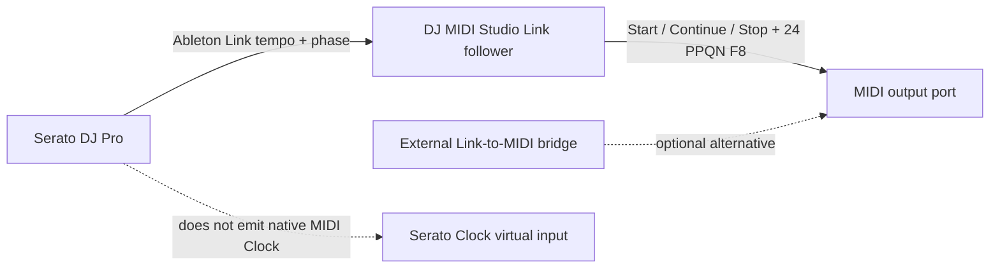

# MIDI Clock compatibility notes

> 🕒 **Clock rule:** configure one authoritative tempo source, one deliberate
> routing path, and verify `CLOCK ACTIVE` before connecting downstream gear.

## Current safety policy

DJ MIDI Studio exposes MIDI Clock as an opt-in GUI routing mode. The mirror
forwards Start, Continue, Stop, and 24 PPQN Clock messages from one or more
configured sources, rejects implausibly short intervals, and reports observed
timing jitter.

Clock topology is validated across normal MIDI routes and Clock routes
together. This prevents a regular route in one direction combined with a
Clock route in the reverse direction from creating a feedback loop. A Clock
source must have at least one distinct destination, and destination names
cannot be duplicated.

The MIDI Routing panel reports four distinct states: policy disabled, routing
configured but blocked by the Preferences safety gate, waiting for source
ticks, and `CLOCK ACTIVE` after recent Clock ticks have actually been received.
`CLOCK INACTIVE` after starting the session reports whether the source port is
not open, open without ticks, or has sent transport without any Clock ticks.

The source selectors contain MIDI input ports and the destination selectors
contain MIDI output ports. For example, a `MIDI4x4 Midi In 1` port cannot be a
destination; choose `MIDI4x4 Midi Out 1` instead.

## Serato DJ

Serato DJ Pro does not emit standard MIDI Clock directly. Consequently,
`DJ MIDI Studio Serato Clock In` is not a native Serato Clock source: enabling
it and selecting it as the source will correctly remain `CLOCK INACTIVE` when
Serato is the only producer. The virtual port is an input endpoint, and its
purpose is to receive ticks from an external bridge if one is deliberately
configured.

The [DJ TechTools four-method overview](https://djtechtools.com/2018/06/27/serato-dj-pro-four-ways-for-syncing-with-external-gear/)
describes the practical alternatives: Ableton Link bridged to MIDI Clock,
an iOS Link-to-MIDI bridge, audio-to-Clock software, or selected certified
hardware that generates Clock from Serato tempo information. This is
consistent with the behavior observed in DJ MIDI Studio: no `F8` ticks can be
forwarded until one of those producers is present.

For a macOS setup with Serato, XDJ-XZ, and DDJ-XP2, the direct path is:

1. Enable Ableton Link in Serato DJ Pro.
2. Install the optional `aalink` binding in DJ MIDI Studio.
3. Select `Ableton Link (DJ MIDI Studio)` as the Clock source, select the
   actual hardware/interface MIDI output as destination, and start routing.

An external Link-to-MIDI bridge remains a valid alternative: select its MIDI
output as a physical source in DJ MIDI Studio and do not enable the virtual
Serato Clock input unless the bridge is deliberately targeting that port.

DJ MIDI Studio can now replace the Live/bridge step when the optional `aalink`
binding is installed. It runs in its own asyncio loop while the GUI polls Link
state from the routing timer. Select `Ableton Link (DJ MIDI Studio)` as the Clock
source, keep `Create virtual input for Serato Clock` disabled, and route it to
the physical MIDI output. DJ MIDI Studio follows Link's tempo and phase and
emits MIDI Clock; it never sets Link's tempo. Install the binding with
`uv sync --extra link` before selecting the Link source. If it is missing, the UI
reports the dependency instead of silently creating a dead route.
The XDJ-XZ and DDJ-XP2 remain control surfaces; this project does not claim
either one as a verified Serato MIDI Clock generator.

If an external bridge is intentionally writing into `DJ MIDI Studio Serato
Clock In`, start DJ MIDI Studio first so the virtual input exists, select that
source, then configure the bridge's MIDI destination to the virtual port. A
`CLOCK INACTIVE` status then means the bridge is not sending `F8` ticks, rather
than a missing Serato setting.

Important direction check: `DJ MIDI Studio Serato Clock In` is a destination
for an external producer and a source inside DJ MIDI Studio. It is not a magic
Serato Clock output. Do not select `MIDI4x4 Midi In 1` or `MIDI4x4 Midi Out 1`
as a substitute for the virtual source; use the port direction reported by the
bridge and choose the MIDI output that is physically connected to the target.

## Traktor

Traktor uses standard MIDI realtime messages for external Clock. Select the
Traktor MIDI output as a physical Clock source in `MIDI Routing`, enable the
Clock policy, and route it to the destination controller or software input.
The application forwards Start, Continue, Stop, and 24 PPQN Clock ticks; it
does not attempt to reinterpret Traktor's beat phase, tempo, transport mode,
or mapping-file settings. Configure Traktor's external Clock mode and verify
the destination's external-sync behavior before a live session.

## Rekordbox

Rekordbox configurations and Performance-mode MIDI behavior vary by version
and connected hardware. A mapping parser match does not prove that Rekordbox
is a valid Clock source or destination. Clock mirror support therefore remains
opt-in and requires a real-device verification of Start/Stop/Continue and
24 PPQN behavior before it can be enabled in the GUI.

## Validation rule

Cross-software Clock sync stays disabled until a test record exists for the
specific Serato/Traktor/Rekordbox versions, hardware ports, direction, and
measured jitter. Virtual-port tests validate routing policy and timing logic;
they do not claim vendor compatibility.
