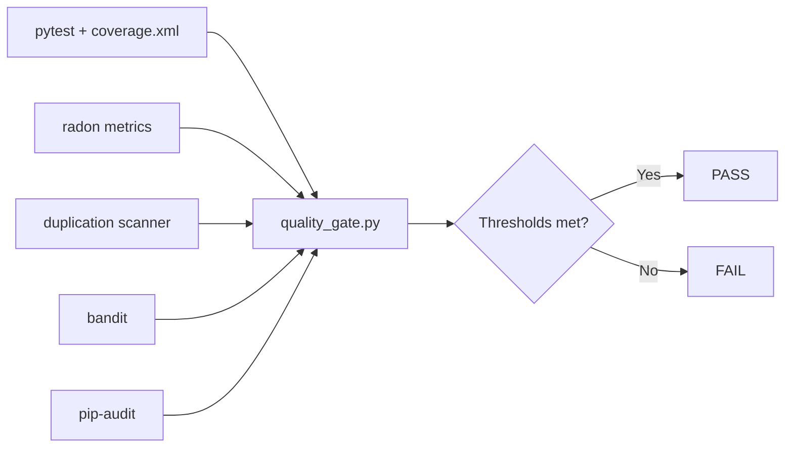

# Quality Gates

## Table of Contents

- [Targets](#targets)
- [How Metrics Are Measured](#how-metrics-are-measured)
- [Run Locally](#run-locally)
- [Troubleshooting](#troubleshooting)

## Targets

This project quality gate enforces:

- Code smell score `>= 90%`
- Test coverage `>= 90%`
- Duplication `< 5%`
- Vulnerabilities: `HIGH = 0` and dependency vulnerability count `= 0`

## How Metrics Are Measured

- Coverage: `pytest` + `pytest-cov` (`coverage.xml` line-rate)
- Code smell score: file-level maintainability (`radon` MI) + max cyclomatic complexity
- Duplication: normalized repeated line-block detection over `src/djmidi`
- Security scan:
  - `bandit` for source-code findings (HIGH must be zero)
  - `pip-audit` for dependency vulnerabilities



## Run Locally

```bash
bash scripts/test.sh quality
```

or directly:

```bash
bash scripts/quality_gate.sh
```

You can skip test execution and reuse an existing `coverage.xml`:

```bash
bash scripts/quality_gate.sh --skip-tests
```

## Troubleshooting

- If coverage is below threshold, add tests first around parser/exporter/GUI edge cases.
- If duplication is high, extract repeated logic into model/services utilities.
- If smell score is low, prioritize high-complexity files and split functions.
- If security gates fail, patch dependencies and re-run `pip-audit`.

