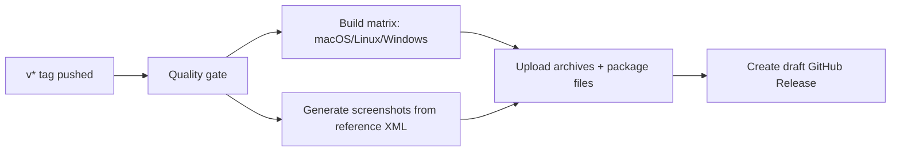

# Release Checklist

## Table of Contents

- [Purpose](#purpose)
- [Pre-Release Preparation](#pre-release-preparation)
- [Version and Changelog](#version-and-changelog)
- [Tagging Strategy](#tagging-strategy)
- [CI Build and Draft Release](#ci-build-and-draft-release)
- [Manual Verification](#manual-verification)
- [Publish Steps](#publish-steps)
- [Rollback Plan](#rollback-plan)

## Purpose

This checklist defines a predictable release process for package and executable artifacts.

## Pre-Release Preparation

1. Ensure your branch is up to date.
2. Run the project bootstrap once (if needed):

```bash
bash scripts/bootstrap.sh
```

3. Run quality checks:

```bash
bash scripts/test.sh all
```

## macOS Security

Before publishing a macOS artifact:

1. Sign it with a `Developer ID Application` certificate.
2. Verify it with `codesign --verify --deep --strict`.
3. Submit the generated ZIP with `xcrun notarytool submit ... --wait`.
4. Staple the ticket with `xcrun stapler staple`.
5. Confirm Gatekeeper accepts it with `spctl --assess --type execute --verbose`.

Do not ask users to disable Gatekeeper or remove quarantine attributes as a
release workaround.

## SCM automation

The repository includes both GitHub Actions and GitLab CI release definitions.
Use `scripts/scm_release.sh` to open the PR/MR, push the annotated version tag,
and optionally create the provider release. Configure only the SCM CLI matching
the selected provider (`gh` or `glab`); do not store tokens in the repository.

## Version and Changelog

1. Update `project.version` in `pyproject.toml`.
2. Update release notes/changelog section in your preferred tracking file.
3. Commit changes.

## Tagging Strategy

Releases are triggered by tags matching `v*`.

```bash
git tag -a v1.0.0 -m "First DJ MIDI Studio release"
git push origin v1.0.0
```

## CI Build and Draft Release

On tag push, workflow `.github/workflows/draft-release.yml`:

- runs the quality gate before packaging,
- builds executable bundles on macOS, Linux, and Windows,
- builds wheel + sdist,
- regenerates the documentation screenshots from
  `data/xdj_xz-ddj_xp2-4decks.xml`,
- attaches all release archives to a **draft GitHub Release**.



## Manual Verification

Before publishing draft release:

1. Download one artifact per OS and verify extraction.
2. Smoke test app start on at least one target machine.
3. Confirm release notes are complete.
4. Confirm the generated screenshots include the Dashboard, mapping views,
   Controller Setup/Images, both MIDI tools docked together, and each MIDI tool
   in its floating reference composition.

## Publish Steps

1. Open GitHub Releases.
2. Edit the generated draft notes if needed.
3. Click **Publish release**.

## Rollback Plan

If a bad draft was produced:

1. Delete the draft release.
2. Delete the problematic tag locally/remotely.
3. Fix issues and recreate a new tag.
