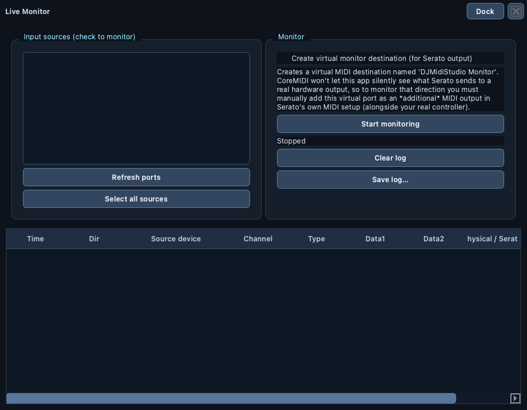
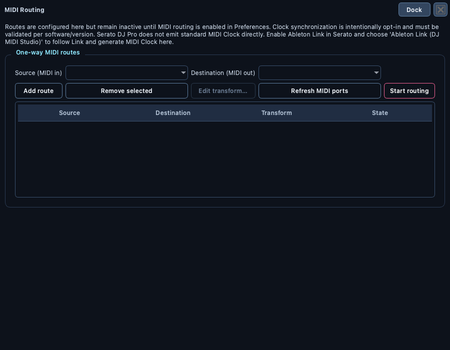
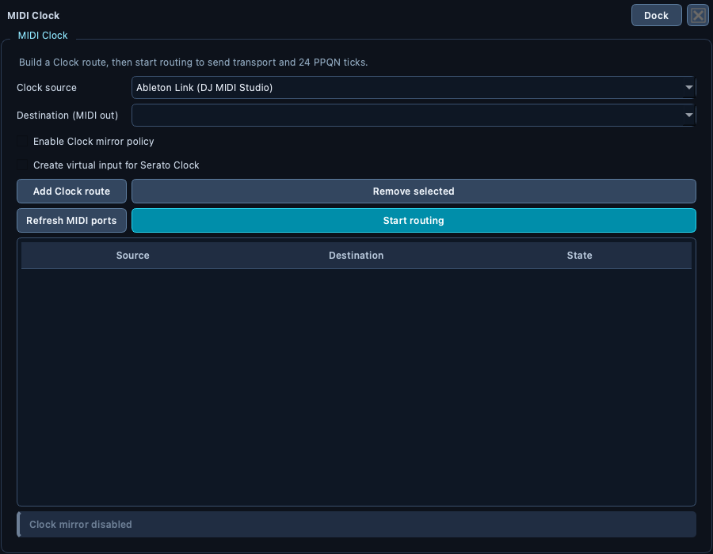
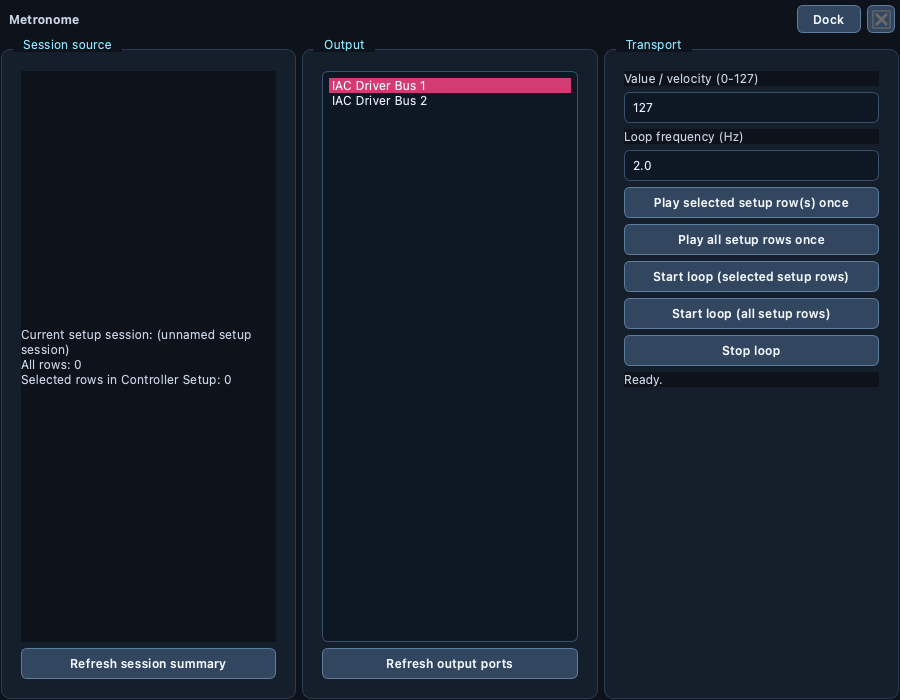
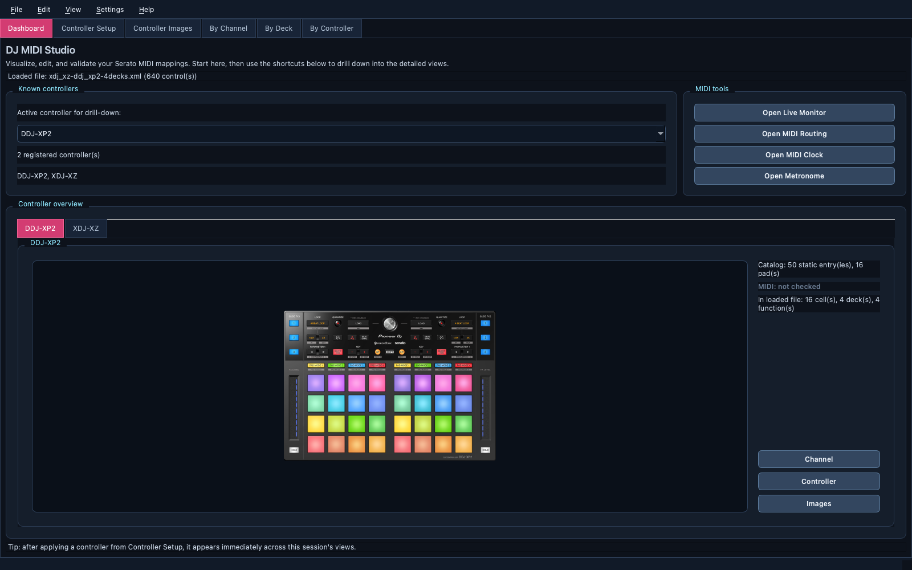
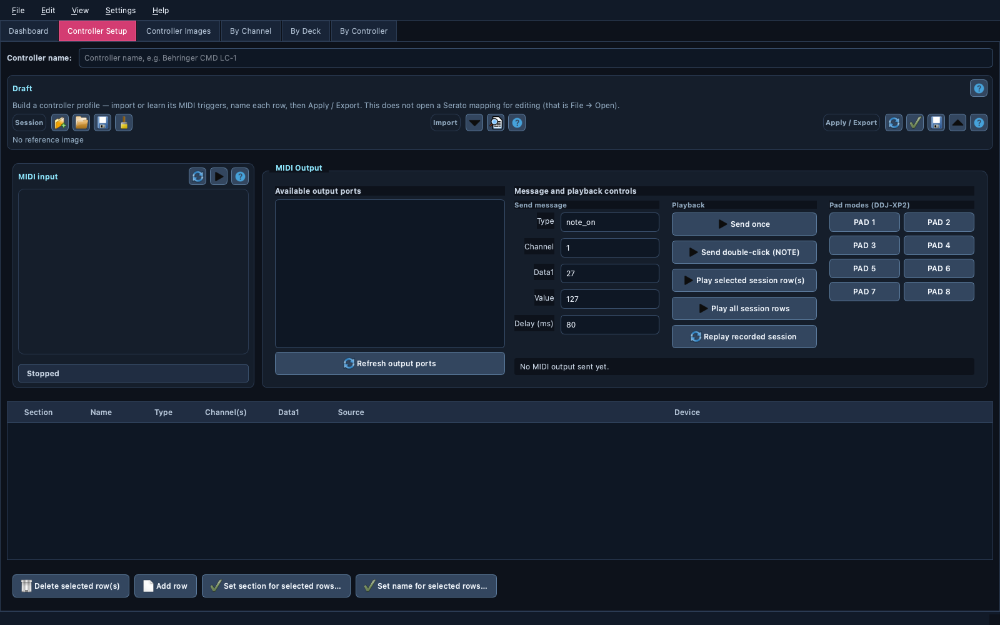
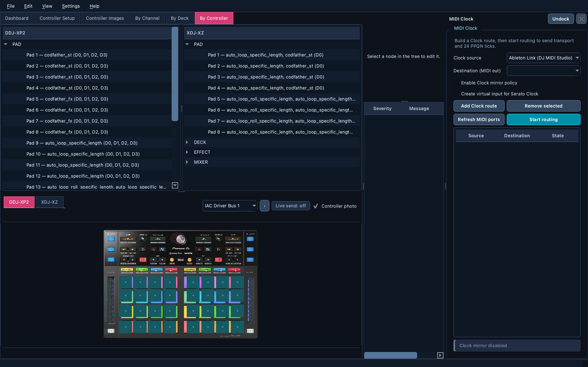
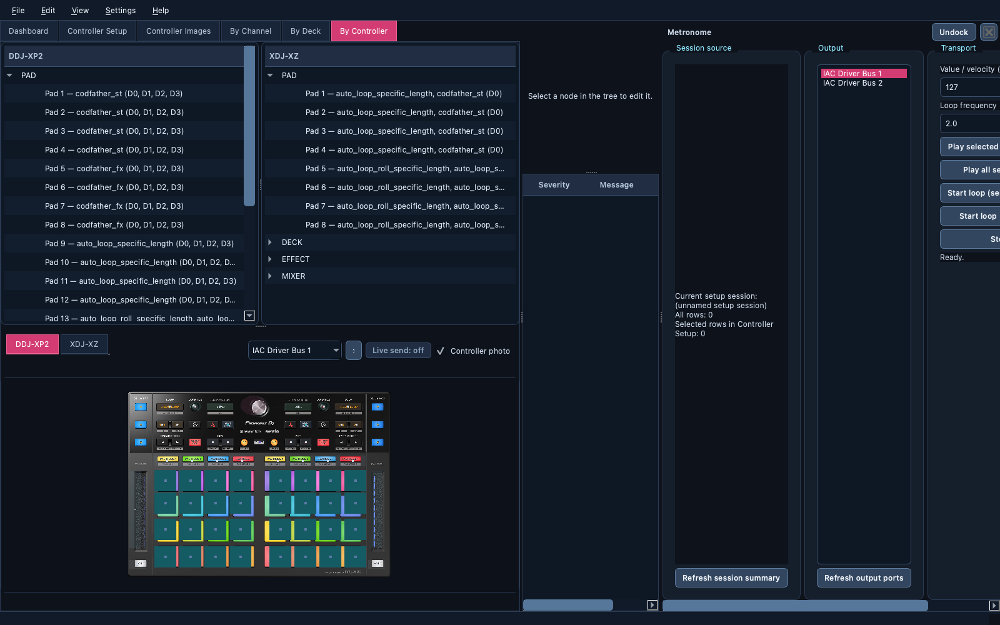

# Screens and Layouts

> 🖥️ A visual tour of the mapping workspace, DJ-oriented controller layouts,
> and docked or floating MIDI tools.

## Table of Contents

- [Application Navigation](#application-navigation)
- [Window Compositions](#window-compositions)
- [Dashboard](#dashboard)
- [Mapping Views](#mapping-views)
- [Controller Setup](#controller-setup)
- [Controller Images](#controller-images)
- [Live Monitor](#live-monitor)
- [MIDI Routing](#midi-routing)
- [MIDI Clock](#midi-clock)
- [Metronome](#metronome)
- [Evolution reference](#evolution-reference)

## Application Navigation

The mapping workspace is organized as tabs across the top of the main window:

`Dashboard`, `Controller Setup`, `Controller Images`, `By Channel`, `By Deck`,
and `By Controller`. `Live Monitor`, `MIDI Routing`, `MIDI Clock`, and
`Metronome` are independent, closable Qt dock panels rather than mapping
tabs. They can be shown from the `View` menu, moved to another dock area,
floated as windows, or opened from the Dashboard buttons.

Each tool supports both workspace modes. Use the float button in its dock title
bar to open it as an independent window, or drag the title bar out of the main
window; drag it back onto a dock area (or use the title bar's dock button) to
return it. Closing a floating tool does not affect any controller mapping tab
or layout splitter.

The main window and dock arrangement are saved when the application closes and
restored on the next launch, together with `MIDI Routing`/`MIDI Clock`'s routes,
Clock mirror configuration (including Ableton Link followers), and port
selections, and `Metronome`'s output port, value, and loop frequency — none of
that view-level configuration is lost on restart. Controller selectors remain
horizontally scrollable, so their content no longer imposes a large minimum
width on the main window or on a floating MIDI tool.

On first launch (before any saved geometry exists) the window opens at a size
derived from the available screen area — a comfortable `1280x820` where the
display allows it, scaled down to fit smaller screens, and centered — instead
of the previous fixed `1100x700` that clipped panels on macOS. The absolute
minimum window size stays small on purpose so the window can still be dragged
narrower than the controller-selector content.

### Window Compositions

The screenshot generator covers the stable reference compositions supported by
the application: all four tools docked in the main window, and each tool
floating. Users can still choose arbitrary dock areas,
positions, and sizes; those combinations are intentionally not enumerated
because they are user-specific and are persisted automatically.

The right-hand edit / validation column is shown only on the tree tabs (`By Channel`, `By Deck`, `By Controller`), where there is a node to edit; `Dashboard`, `Controller Setup`, and `Controller Images` use the full width. On a tree tab, selecting a mapping or a layout cell keeps the related views synchronized, and the "select a node…" prompt is replaced by the edit form once a node is selected.

Helpful Notes is intentionally a separate startup popup rather than another
dashboard panel. It can be reopened from `View -> Helpful Notes...`; closing
it offers a persistent or session-only choice.

On macOS, entering or leaving native full screen may briefly show the window
surface being rebuilt. DJ MIDI Studio queues a repaint after the transition;
if the surface still appears black, leave full screen once and re-enter it so
macOS can recreate the window backing surface.

The `Help` menu provides the complete local project documentation, bundled
controller references, and official external links. Local Markdown and PDF
files are opened from the application bundle, so the documentation remains
available with a packaged release.

## Dashboard

The Dashboard shows the loaded Serato file, the registered controllers, catalog statistics, MIDI availability indicators, and shortcuts into the detailed views. Controller overview is presented as one spacious tab per controller, with the reference image on the left and vertical `Channel`, `Controller`, and `Images` actions on the right. The active controller selector still controls those drill-down actions. Availability is detected from the currently listed MIDI input ports; `MIDI: available` means a port name matches the controller catalog, while `MIDI: not detected` means no match was found.

The current catalog contains DDJ-XP2, XDJ-XZ, DDJ-1000, DDJ-FLX4, DDJ-FLX10, DDJ-REV1, Numark Mixtrack Pro FX, and Hercules DJControl Inpulse 500. Controller Setup definitions applied during the current session also appear here immediately. Reference artwork is available for all eight built-in controllers. The DDJ-FLX10 and DDJ-REV1 images are annotated official MIDI message-list diagrams; the DDJ-FLX4, Numark, and Hercules images are official product views used as physical-layout references, not complete MIDI message maps.

## Mapping Views

### By Channel

By Channel is the most granular editing view. It presents the raw MIDI controls grouped by channel and exposes the underlying `Control`, `UserIO`, and mapping hierarchy. Use it when an individual XML mapping must be inspected or edited precisely.

### By Deck

By Deck groups duplicate Serato trigger sets by deck and slot. The upper area contains one tree per deck, while the lower layout area shows the physical controls for the selected controller. Layout cells use DJ-oriented glyphs: square pads, buttons, rotary knobs, vertical faders, and jog wheels. Each physical zone (PAD, DECK, EFFECT, MIXER, …) is drawn as a labelled framed panel. The XDJ-XZ and DDJ-XP2 also have their own schematic proportions — DDJ-XP2 compact and pad-forward, XDJ-XZ wide with a central mixer strip — and zone placement that echoes the real device; other controllers use the generic uniform grid. The glyph is inferred from catalog vocabulary and does not alter the underlying MIDI mapping. Clicking a lower layout cell selects the matching group in the tree and keeps the By Deck tab active. The horizontally scrollable controller selector and deck filter allow the physical view to be narrowed to a specific device or deck, even when many controller plugins are installed.

### By Controller

By Controller groups catalog entries by physical controller and section, such as `PAD`, `DECK`, or `EFFECT`. The lower DJ layout maps the selected controller's controls and shows the associated mappings. It uses a dark performance-oriented canvas with each zone framed and labelled, deck colors, and high-contrast selection accents. Pads, color-coded transport buttons, knobs, faders, and jog wheels are rendered as compact interactive controls sized by per-controller metrics, with the pad bank centered in the initial viewport for quicker inspection. The XDJ-XZ and DDJ-XP2 also show display-only mixer controls such as trim, EQ, volume, crossfader, and Slide FX faders; these make the hardware surface legible even though continuous MIDI mappings are not yet in the discrete catalog. Controllers without dedicated geometry use the same generic grid and remain fully usable. Its controller selector scrolls horizontally as the dynamic catalog grows. Clicking a mapped layout control selects the matching physical-control item in the upper tree and keeps the By Controller tab active. Current selections use a strong highlight; recent previous selections remain visible with a faded highlight, making navigation history easier to follow.

## Controller Setup

Controller Setup is used to learn MIDI triggers from hardware or import raw triggers from a Serato XML file. The captured table records the section, physical name, MIDI type, channel(s), data value, source, and device. The `Draft` panel at the top is a single icon toolbar: a `Session`, `Import`, and `Apply / Export` group, each with its caption in front of its buttons, spread across the window width. `MIDI input` (learning: input port list, `Start learning`, status) sits at the start of the same row as `MIDI Output`, whose panel has a dedicated output port list, readable message fields, playback actions, and all eight DDJ-XP2 pad-mode buttons. `Available output ports` is checkbox-based like the input list — check several ports to send/replay/play-rows to all of them at once, not just one; one port stays pre-checked by default.

The captured table is multi-selectable. Beside `Delete selected row(s)` and `Add row`, `Set section for selected rows…` assigns one Section to every selected row in a single prompt, and `Set name for selected rows…` assigns a Name, optionally auto-numbered (`PAD 1`, `PAD 2`, …) across the selection. A bulk edit re-runs the trigger conflict check and warns immediately if it collides two rows.

`Attach reference image…` (Import panel) picks a local PNG/JPG for a controller that has no bundled diagram. The image is referenced by its path on this machine — it is not copied into the project — and is saved in the session JSON. After `Apply now` it appears in the Controller Images tab like a built-in; `Generate catalog module…` writes `reference_image=<filename>`, and the completion dialog reminds you to place a copy at `assets/controllers/<filename>` if you want it bundled (user-supplied images are your responsibility with respect to licensing).

The same tab provides MIDI output controls for sending a command once, sending a NOTE double-click, replaying selected/all session rows, or generating a catalog module. `Check for conflicts` should be run before applying or exporting a catalog. `Submit to community catalog…` (Apply / Export panel) validates the draft, then opens a pre-filled GitHub issue and copies the profile JSON to the clipboard so a manually built controller can be reviewed and shipped as a built-in; reference images are not part of a submission.

## Controller Images

Controller Images displays the official reference artwork for the selected catalog controller. The view supports zooming, panning, resetting the zoom, and opening the bundled local controller documentation when available. The selector includes every registered controller; controllers without reference artwork show an explicit placeholder instead of an inaccurate diagram. Artwork is currently available for DDJ-XP2, XDJ-XZ, DDJ-1000, DDJ-FLX4, DDJ-FLX10, DDJ-REV1, Numark Mixtrack Pro FX, and Hercules DJControl Inpulse 500. A controller built in Controller Setup can carry a user-attached image (an absolute path), which this viewer resolves the same way as a bundled filename.

A `Show real layout` checkbox overlays colored markers directly on the real photo at each modeled control's true position. Modeled so far: XDJ-XZ's transport cluster (PLAY/PAUSE, CUE, SYNC, jog wheel, tempo fader) and essentially all of DDJ-XP2 (its pad grid, PAD MODE buttons, SLIDE FX bank, loop/quantize/key controls, browse/load buttons, and SHIFT). It's disabled with a tooltip for any controller with no modeled geometry yet. This overlay doesn't reflect the loaded mapping — but it does flash white on a real, live MIDI hit for whichever controller this tab currently shows, the same live feedback the `By Channel`/`By Deck`/`By Controller` layouts already give (see `Live Monitor` below, and `Settings -> Preferences...` to control whether that starts automatically).

## Live Monitor

Live Monitor watches checked MIDI input sources in real time. Use `Refresh ports` to update the list or `Select all sources` to check every currently available input. The monitor can also create a virtual destination for Serato output, provided that destination is added as an additional MIDI output in Serato.

The event table contains the timestamp, direction, source device, MIDI channel and data, followed by the physical control and Serato function resolution. Physical control names are filtered using the source device so that a matching control from another controller is not reported accidentally.

The floating reference is shown in [Window Compositions](#window-compositions).

## Evolution reference

The latest screenshots document the current post-`v0.46.0` composition:

| Chapter | Primary references |
| --- | --- |
| Independent MIDI Clock | `midi-clock.png`, `midi-clock-floating.png` |
| DJ performance theme | `by-deck.png`, `by-controller.png` |
| Responsive dashboard and setup | `dashboard.png`, `controlleur-setup.png` |
| Dock orchestration | `midi-tools-docked.png`, floating tool captures |

For the implementation timeline and validation boundary, see [Recent Evolution
Chapters](development/evolution.md).

## MIDI Routing

MIDI Routing configures one-way source/destination routes. Its source and
destination lists are loaded when the view opens and can be refreshed
independently with `Refresh MIDI ports`. Physical routing remains disabled
unless enabled in Preferences. A selected route can carry an optional value
transform — channel remap, note/CC offset, invert value — via `Edit
transform…`; the routes table's `Transform` column summarizes it (e.g. `Ch
3, +12, invert`) or shows `—` when a route is a plain passthrough.

## MIDI Clock

MIDI Clock is an independent closable, movable, and floating tool. It contains
the opt-in Clock destination policy, source activity indicator, and Clock route
table. Its MIDI device lists are loaded at startup and can be refreshed with
`Refresh MIDI ports`. The source selector contains physical MIDI inputs plus `Ableton Link (DJ
MIDI Studio)`. The bundled `aalink` binding provides Link access, follows Link
tempo/phase without changing it, and emits 24 PPQN MIDI Clock. The route engine
prevents cycles and the Clock policy rejects invalid source/destination pairs.
Cross-software Clock use must meet the [compatibility notes](midi-clock-compatibility.md).

The floating reference is shown in [Window Compositions](#window-compositions).

## Metronome

Metronome is a loop-oriented MIDI session player driven by the current
Controller Setup session: it plays the selected or all captured rows once, or
repeats them at a configurable Hz frequency to a chosen MIDI output port.
Previously merged into MIDI Routing's "Controller Setup playback" panel, it
was pulled back out into its own `View`-menu dock so it no longer competes
for space with routing/Clock configuration.

The floating reference is shown in [Window Compositions](#window-compositions).
