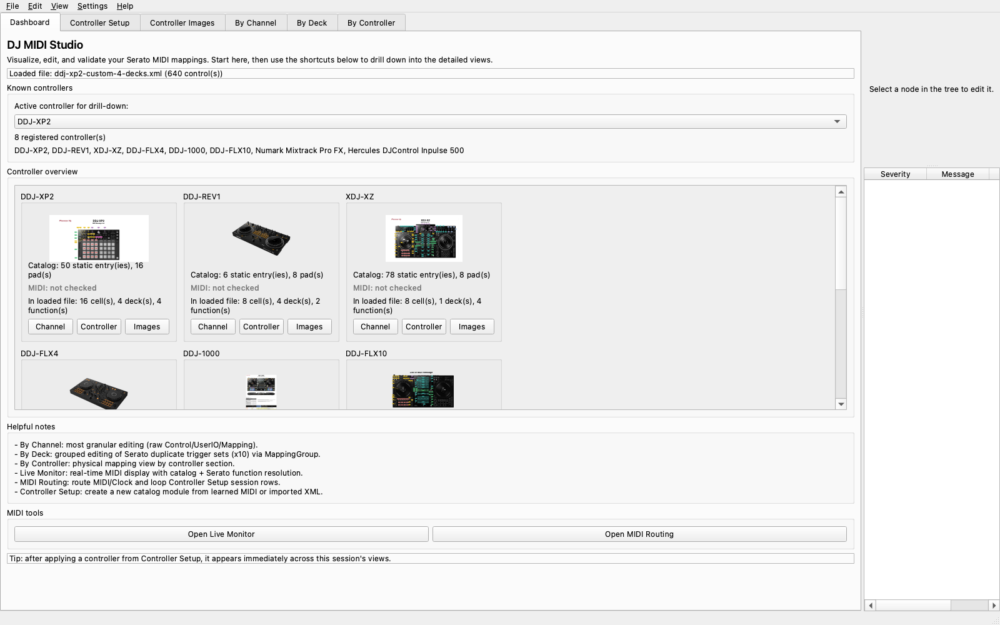
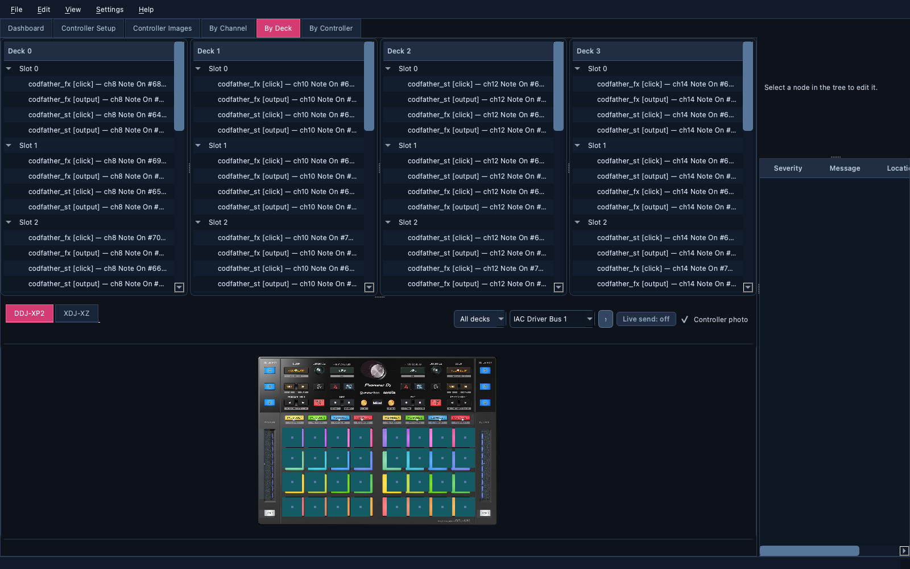
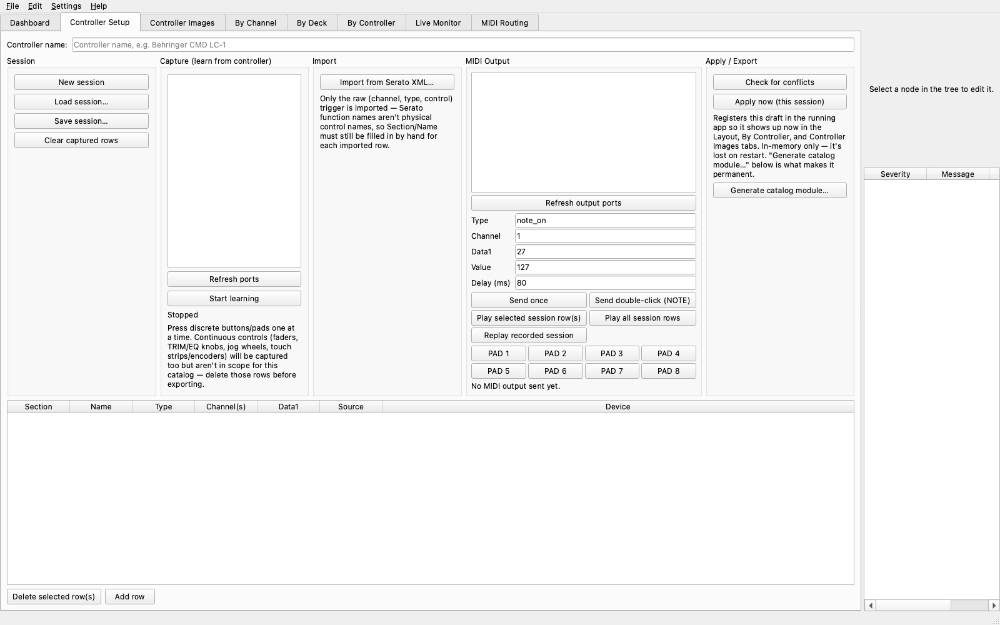
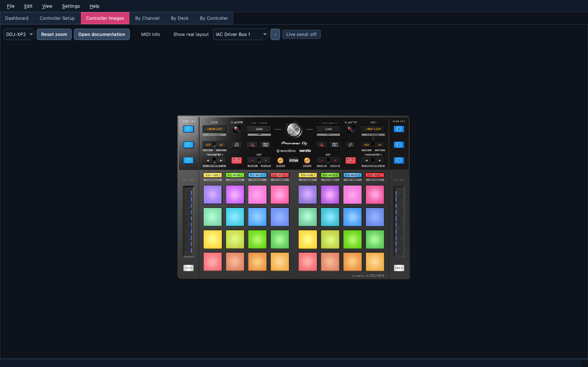
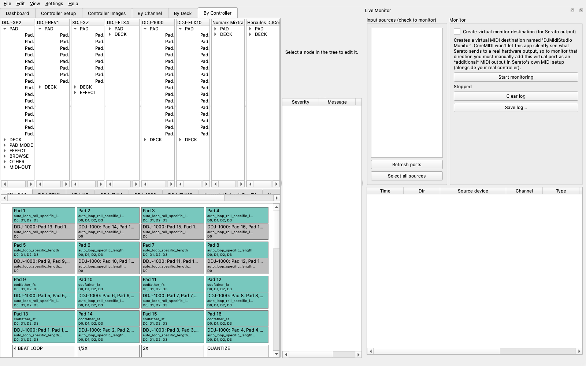
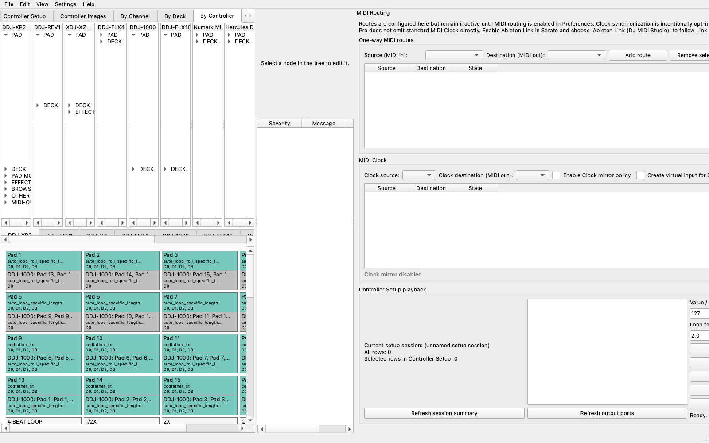

# Screens and Layouts

## Table of Contents

- [Application Navigation](#application-navigation)
- [Dashboard](#dashboard)
- [Mapping Views](#mapping-views)
- [Controller Setup](#controller-setup)
- [Controller Images](#controller-images)
- [Live Monitor](#live-monitor)
- [MIDI Routing](#midi-routing)

## Application Navigation

The mapping workspace is organized as tabs across the top of the main window:

`Dashboard`, `Controller Setup`, `Controller Images`, `By Channel`, `By Deck`,
and `By Controller`. `Live Monitor` and `MIDI Routing` are independent,
closable Qt dock panels rather than mapping tabs. They can be shown from
`View > MIDI Tools`, moved to another dock area, floated as windows, or opened
from the Dashboard buttons.

Each tool supports both workspace modes. Use the float button in its dock title
bar, or choose `View > MIDI Tools > Float Live Monitor` / `Float MIDI Routing`,
to open it as an independent window. Trigger the same menu item again to dock
it back into the main window; closing a floating tool does not affect any
controller mapping tab or layout splitter.

The main window and dock arrangement are saved when the application closes and
restored on the next launch. Controller selectors remain horizontally
scrollable, so their content no longer imposes a large minimum width on the
main window or on a floating MIDI tool.

The right-hand panel remains available from every tab for the current selection and validation messages. Selecting a mapping or a layout cell keeps the related views synchronized.

On macOS, entering or leaving native full screen may briefly show the window
surface being rebuilt. DJ MIDI Studio queues a repaint after the transition;
if the surface still appears black, leave full screen once and re-enter it so
macOS can recreate the window backing surface.

The `Help` menu provides the complete local project documentation, bundled
controller references, and official external links. Local Markdown and PDF
files are opened from the application bundle, so the documentation remains
available with a packaged release.

## Dashboard

The Dashboard shows the loaded Serato file, the registered controllers, catalog statistics, MIDI availability indicators, and shortcuts into the detailed views. Controller overview cards are arranged in three compact 250-pixel columns so the catalog remains readable without taking over the Dashboard; the overview scrolls horizontally when the window is narrower. Each card uses compact `Channel`, `Controller`, and `Images` buttons to open its detailed view. The active controller selector controls those drill-down actions. Availability is detected from the currently listed MIDI input ports; `MIDI: available` means a port name matches the controller catalog, while `MIDI: not detected` means no match was found.

The current catalog contains DDJ-XP2, XDJ-XZ, DDJ-1000, DDJ-FLX4, DDJ-FLX10, DDJ-REV1, Numark Mixtrack Pro FX, and Hercules DJControl Inpulse 500. Controller Setup definitions applied during the current session also appear here immediately. Reference artwork is available for all eight built-in controllers. The DDJ-FLX10 and DDJ-REV1 images are annotated official MIDI message-list diagrams; the DDJ-FLX4, Numark, and Hercules images are official product views used as physical-layout references, not complete MIDI message maps.

## Mapping Views

### By Channel

By Channel is the most granular editing view. It presents the raw MIDI controls grouped by channel and exposes the underlying `Control`, `UserIO`, and mapping hierarchy. Use it when an individual XML mapping must be inspected or edited precisely.

### By Deck

By Deck groups duplicate Serato trigger sets by deck and slot. The upper area contains one tree per deck, while the lower layout area shows the physical controls for the selected controller. Clicking a lower layout cell selects the matching group in the tree and keeps the By Deck tab active. The horizontally scrollable controller selector and deck filter allow the physical view to be narrowed to a specific device or deck, even when many controller plugins are installed.

### By Controller

By Controller groups catalog entries by physical controller and section, such as `PAD`, `DECK`, or `EFFECT`. The lower schematic maps the selected controller's controls and shows the associated mappings. Its controller selector scrolls horizontally as the dynamic catalog grows. Clicking a schematic cell selects the matching physical-control item in the upper tree and keeps the By Controller tab active. Current selections use a strong highlight; recent previous selections remain visible with a faded highlight, making navigation history easier to follow.

## Controller Setup

Controller Setup is used to learn MIDI triggers from hardware or import raw triggers from a Serato XML file. The captured table records the section, physical name, MIDI type, channel(s), data value, source, and device.

The same tab provides MIDI output controls for sending a command once, sending a NOTE double-click, replaying selected/all session rows, or generating a catalog module. `Check for conflicts` should be run before applying or exporting a catalog.

## Controller Images

Controller Images displays the official reference artwork for the selected catalog controller. The view supports zooming, panning, resetting the zoom, and opening the bundled local controller documentation when available. The selector includes every registered controller; controllers without reference artwork show an explicit placeholder instead of an inaccurate diagram. Artwork is currently available for DDJ-XP2, XDJ-XZ, DDJ-1000, DDJ-FLX4, DDJ-FLX10, DDJ-REV1, Numark Mixtrack Pro FX, and Hercules DJControl Inpulse 500.

## Live Monitor

Live Monitor watches checked MIDI input sources in real time. Use `Refresh ports` to update the list or `Select all sources` to check every currently available input. The monitor can also create a virtual destination for Serato output, provided that destination is added as an additional MIDI output in Serato.

The event table contains the timestamp, direction, source device, MIDI channel and data, followed by the physical control and Serato function resolution. Physical control names are filtered using the source device so that a matching control from another controller is not reported accidentally.

## MIDI Routing

MIDI Routing configures one-way source/destination routes and the opt-in Clock
destination policy, and Controller Setup playback. The Clock source selector
contains physical MIDI inputs plus `Ableton Link (DJ MIDI Studio)`. The latter
requires the optional `aalink` binding, follows Link tempo/phase without
changing it, and emits 24 PPQN MIDI Clock. The route engine prevents cycles
and the Clock policy rejects invalid source/destination pairs. Physical
routing remains disabled unless enabled in Preferences, and cross-software
Clock use must meet the [compatibility notes](midi-clock-compatibility.md).

