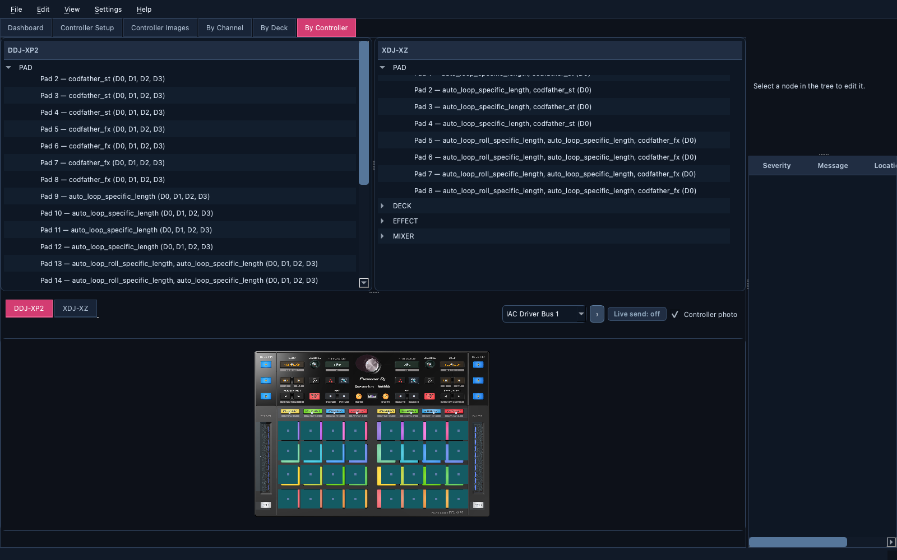
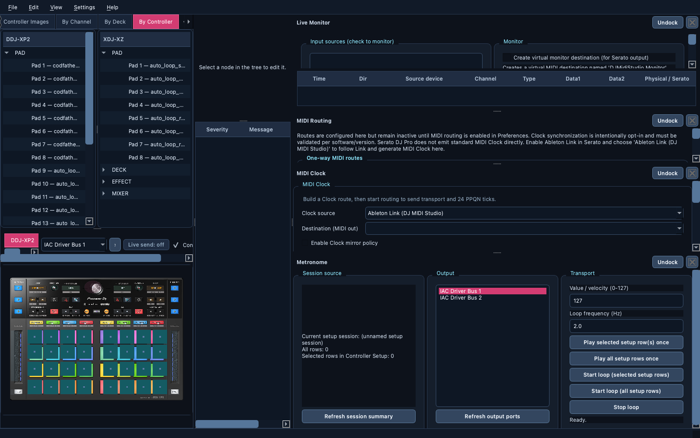

# User Guide

> 🎚️ Learn the everyday workflow: open a mapping, explore its physical
> controls, edit safely, validate, and export with confidence.

## Table of Contents

- [Open a Mapping File](#open-a-mapping-file)
- [Explore Mappings](#explore-mappings)
- [Screens and Layouts](#screens-and-layouts)
- [Edit Safely](#edit-safely)
- [Validate and Export](#validate-and-export)
- [Live Monitor Notes](#live-monitor-notes)
- [Send MIDI Commands](#send-midi-commands)

## Open a Mapping File

1. Start the app.
2. Use `File -> Open...` and choose your mapping file. With the detection policy
   set to `Suggest detected integration`, a high-confidence Serato or Traktor
   signature selects the parser automatically; the default `Ask before enabling`
   policy keeps the plugin choice explicit.

Traktor mappings use NML/XML files. Ambiguous extensions still open the plugin
selector so an XML suffix alone cannot choose the wrong parser.

## Execution logs

DJ MIDI Studio writes a rotating execution log in the platform user log
directory. For troubleshooting, start it with a more verbose level and an
explicit destination:

```bash
uv run djmidi --log-level DEBUG --log-file /tmp/djmidi.log
```

Available levels are `DEBUG`, `INFO`, `WARNING`, `ERROR`, and `CRITICAL`.

## Preferences

Use `Settings -> Preferences...` to review the dynamically discovered
controller and software plugins. The dialog persists plugin enablement,
detection policy, routing policy, external-plugin trust, and log verbosity.
Disabled plugins remain visible in this dialog for re-enablement, but are
removed from active controller selectors, MIDI detection, catalog lookup, and
mapping parser selection immediately after saving.
Safe defaults require confirmation for detection, keep routing disabled, and
do not trust external plugins automatically.

Unknown MIDI hardware can be kept usable through the generic MIDI profile. It
records the learned channel, event type, and data value without claiming that
the device matches a known controller catalog.

Configuration-writing integrations follow a safe-update policy: validate the
candidate, inspect its diff, create a backup, apply atomically, and retain an
explicit rollback path. `File -> Save` and `File -> Save As...` show the diff
before applying it; `File -> Rollback Last Save` restores the backup created by
the last successful save.

The application can now produce an assisted detection result from the mapping
file signature/extension and MIDI port names. When available, controller
identity replies and declared MIDI capabilities add evidence to the score. The
result includes its reason and confidence; ambiguous or unknown results leave
explicit plugin selection to the user. A high-confidence controller match
selects that catalog in the Dashboard and layout views; ambiguous matches are
either confirmed or shown as suggestions according to Preferences.

## Explore Mappings



- `Dashboard`: one spacious controller overview tab per registered controller, with MIDI availability, context, and quick drill-down actions.
- `By Channel`: raw model-level controls and mappings.
- `By Deck`: grouped duplicate mappings (safe synchronized edits).
- `By Controller`: physical layout/section perspective.
- `Controller Images`: static official diagrams and bundled controller documentation.
- `MIDI Routing`: route MIDI and replay Controller Setup rows once or in a loop.
- `MIDI Clock`: configure Clock sources/destinations and inspect source activity;
  both Clock and Routing device lists load at startup and offer `Refresh MIDI ports`.
- `Controller Setup`: capture/import controller triggers, send one-shot session commands, and generate catalog modules.

The Dashboard overview gives each controller its own tab. The reference image
uses the main area, while `Channel`, `Controller`, and `Images` remain readable
in a vertical action column.

Controller Setup keeps learning, import, and export at the top and gives MIDI
Output its own full-width panel. The output port list, message fields,
playback actions, and PAD MODE 1–8 buttons remain available without a cramped
five-column layout.

`Live Monitor`, `MIDI Routing`, and `MIDI Clock` are independent MIDI tool docks, not mapping
tabs. Open them from `View -> MIDI Tools` or the Dashboard; use the dock title
bar or the View menu to float them, dock them again, or close them. The main
window geometry and dock arrangement are restored on the next launch.

For screenshots and a visual description of each tab, see [Screens and Layouts](screens-and-layouts.md).

## Screens and Layouts



- Use `Dashboard` for loaded-file status, controller catalog cards, MIDI availability, and drill-down shortcuts.
- Use `By Channel` for the raw control and mapping hierarchy.
- Use `By Deck` for grouped per-deck editing and physical layout verification; clicking a layout cell selects its matching tree group without leaving the tab.
- Use `By Controller` for controller/section-oriented physical mapping; clicking a layout cell selects the corresponding physical-control tree item without leaving the tab.
- Use `Controller Images` for zoomable reference diagrams and the local controller documentation button.
- Use `Live Monitor` to inspect real-time MIDI traffic by source device.
- Use the `Controller Setup playback` section in `MIDI Routing` to replay rows once or in a loop.

## Edit Safely

- Prefer grouped edits in `By Deck` when dealing with Serato duplicate trigger sets.
- Use the DJ-oriented layout views to verify the physical control impacted by your edit. The dark performance theme groups sections visually and uses deck colors plus bright selection accents. Pads, transport buttons, knobs, faders, and jog wheels are shown with distinct glyphs. XDJ-XZ and DDJ-XP2 also expose display-only mixer controls for trim, EQ, volume, crossfader, and Slide FX; these are visual references until continuous MIDI mappings are cataloged. The generic grid remains available for unknown controls. The current selection is strongly highlighted and the last few previous selections remain softly highlighted as navigation history. The right-side `Physical control` panel reserves expanded, splitter-safe space for multiple catalog matches.

## Validate and Export

1. Run `Edit -> Validate`.
2. Inspect errors/warnings/info in the right panel.
3. Save with `File -> Save` or `File -> Save As...`.

## Live Monitor Notes

- Input monitoring works from selected MIDI input ports.
- Output-direction monitoring from Serato requires adding the app virtual destination in Serato MIDI setup.
- The MIDI engine exposes one-way routing and an initial Clock mirror. Open the
  independent `MIDI Clock` tool from `View > MIDI Tools`, enable MIDI routing
  in Preferences, add at least one route, then use `Start routing`
  to open the selected physical MIDI ports. `Stop routing` closes them again;
  routing remains disabled by default and port failures stop the session safely.
  When a Clock policy is enabled, each configured source → destination line is
  opened by the same session and realtime Start/Continue/Stop/Clock messages
  are forwarded with the configured jitter safeguards.
  Serato DJ Pro does not emit standard MIDI Clock directly. For a direct
  workflow, install DJ MIDI Studio normally, enable Link in Serato, and
  select `Ableton Link (DJ MIDI Studio)` as the Clock source. DJ MIDI Studio
  follows Link and emits 24 PPQN MIDI Clock without changing Link's tempo.
  `Create virtual input for Serato Clock` remains for an external bridge that
  explicitly sends ticks into that virtual port.
  For Traktor, select its MIDI output as the physical Clock source and
  configure Traktor's external Clock mode.

  The Clock status label is a live diagnostic: `CLOCK ACTIVE` confirms that
  ticks are arriving from the selected source; `CLOCK INACTIVE` means the
  session is running but no recent ticks were received. With Serato, this
  normally means that the Link binding is missing, Serato is not connected to
  the Link session, or no external bridge is producing MIDI Clock. In direct
  mode, Link tempo/phase reception and MIDI Clock generation happen inside DJ
  MIDI Studio; in bridge mode they remain separate steps.

Use the `MIDI Routing` dock to configure one-way source/destination routes and
the `MIDI Clock` dock to configure the opt-in Clock policy. Add several Clock
source/destination lines when needed;
the policy is inactive until routing is enabled in
Preferences, and Clock synchronization remains subject to the documented
Serato/Traktor/Rekordbox compatibility checks.

## Send MIDI Commands

Use the CLI helper to send direct NOTE/CC output to a controller:

```bash
uv run djmidi-send-midi --list-ports
uv run djmidi-send-midi --port "Your Port Name" --type note_on --channel 1 --data1 27 --data2 127
uv run djmidi-send-midi --port "Your Port Name" --type note_off --channel 1 --data1 27 --data2 0
```

For DDJ-XP2 mode switching by double-click, you can use:

```bash
uv run djmidi-send-midi --port "Your Port Name" --type note_on --channel 1 --data1 27 --data2 127 --double-click
```

DDJ-XP2 known pad mode button note values (channels 1..4):

- `27` = `PAD MODE 1`
- `30` = `PAD MODE 2`
- `32` = `PAD MODE 3`
- `34` = `PAD MODE 4`

The second physical click is emitted as a distinct NOTE, rather than a second
`27/30/32/34` event:

- `28` = `PAD MODE 5`
- `31` = `PAD MODE 6`
- `33` = `PAD MODE 7`
- `35` = `PAD MODE 8`

On real hardware, `PAD MODE 5..8` are reached by double-clicking `PAD MODE 1..4`.
So in practice:

- double-click `PAD MODE 1` to reach `PAD MODE 5`
- double-click `PAD MODE 2` to reach `PAD MODE 6`
- double-click `PAD MODE 3` to reach `PAD MODE 7`
- double-click `PAD MODE 4` to reach `PAD MODE 8`

Inside the GUI:

- use `Controller Setup` to send one-shot commands from the current saved/loaded session to the selected MIDI output;
- use `Controller Setup playback` in `MIDI Routing` when you want loop/repeat playback with a configurable frequency.
